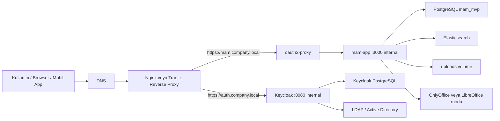

# MAM Deneme Şirket Server Kurulum Dokümanı

Güncel tarih: 02.05.2026

Bu doküman `mam_deneme` uygulamasını şirket içi bir server'a kurmak, mevcut LDAP/Active Directory ile entegre etmek, DNS üzerinden erişilebilir hale getirmek ve yetki modelini kurumsal gruplarla yönetmek için hazırlanmıştır.

Amaçlar:
- Kullanıcıların IP/port yazmadan DNS adı ile erişmesi
- Browser girişinin Keycloak + `oauth2-proxy` ile korunması
- Mevcut LDAP kullanıcılarının kullanılabilmesi
- LDAP dışı lokal Keycloak kullanıcılarının da desteklenmesi
- Yetkilerin LDAP grupları veya Keycloak rolleri üzerinden yönetilebilmesi
- Production ortamda `start-dev` yerine doğru Keycloak çalışma modeline geçilmesi
- Backup, güncelleme ve diagnostik süreçlerinin netleşmesi

---

## 1. Önerilen Production Mimari

Şirket server kurulumunda RPI/lokal kurulumdan farklı olarak dış erişimi doğrudan container portlarına vermemek gerekir. Önerilen mimari:



Temel ayrım:
- `oauth2-proxy`, MAM uygulamasını korur.
- Keycloak, kimlik sağlayıcıdır.
- Nginx/Traefik, HTTPS, DNS routing ve dış yayın katmanıdır.

`oauth2-proxy`, Keycloak önündeki reverse proxy yerine geçmez. Keycloak'ın güvenli ve doğru hostname ile yayınlanması için ayrıca Nginx/Traefik gerekir.

---

## 2. DNS Planı

Production için IP yerine DNS kullanılması önerilir. Örnek:

```text
mam.company.local       -> şirket server IP
auth.company.local      -> şirket server IP
office.company.local    -> şirket server IP, sadece OnlyOffice kullanılacaksa
```

Alternatif tek domain + path yaklaşımı mümkündür ama Keycloak ve oauth callback ayarları daha karmaşık olur. En sade ve stabil yaklaşım ayrı subdomain kullanmaktır.

Önerilen:
```text
https://mam.company.local
https://auth.company.local
```

Mobil uygulama ayarları:
```text
Host/IP:       https://mam.company.local
API base URL:  https://mam.company.local
OIDC issuer:   https://auth.company.local/realms/mam
```

Not:
- Mobil app doğrudan `3001` portuna bağlanmak zorunda kalmamalı.
- Production'da API de reverse proxy üzerinden HTTPS ile yayınlanmalıdır.
- Direct app portu (`3001`) dış dünyaya açılmamalıdır.

---

## 3. Server Gereksinimleri

Minimum öneri:
- Ubuntu Server 22.04 LTS veya 24.04 LTS
- Docker Engine
- Docker Compose plugin
- En az 4 CPU
- En az 16 GB RAM
- SSD disk
- Ayrı ve yedeklenebilir upload alanı

Pratik öneri:
- Küçük ekip/test: 4 CPU / 16 GB RAM / 500 GB SSD
- Orta kullanım: 8 CPU / 32 GB RAM / 1-2 TB SSD
- OCR/altyazı yoğun kullanım: ayrı işçi server veya daha fazla CPU/RAM düşünülmeli

Önemli bileşenler:
- `mam-app`: Node.js uygulama
- `postgres`: MAM veritabanı
- `elasticsearch`: arama indexleri
- `keycloak`: login, LDAP, OIDC
- `keycloak-postgres`: Keycloak veritabanı
- `oauth2-proxy`: browser login koruması
- `onlyoffice`: opsiyonel; Office edit gerekiyorsa
- `libreoffice`: opsiyonel; offline read-only preview için

---

## 4. Port ve Firewall Planı

Production dış erişimde sadece reverse proxy portları açık olmalıdır:

```text
80/tcp   HTTP -> HTTPS redirect
443/tcp  HTTPS
```

İçeride container portları:

```text
oauth2-proxy:       4180 internal
mam-app:            3000 internal
keycloak:           8080 internal
postgres:           5432 internal
keycloak-postgres:  5432 internal
elasticsearch:      9200 internal
onlyoffice:         80 internal, opsiyonel
```

Dışarı açılmaması önerilenler:
```text
3000
3001
5432
8081
8082
9200
```

RPI/lokal geliştirmede portlar açıktı. Şirket server'ında bu model değiştirilmelidir.

---

## 5. Kurulum Dizini ve Volume Planı

Önerilen dizin:

```bash
/opt/mam_deneme
```

Upload storage:

```bash
/srv/mam/uploads
```

Backup dizini:

```bash
/srv/mam/backups
```

Kurulum:

```bash
sudo mkdir -p /opt/mam_deneme /srv/mam/uploads /srv/mam/backups
sudo chown -R $USER:$USER /opt/mam_deneme /srv/mam/uploads /srv/mam/backups
cd /opt/mam_deneme
git clone https://github.com/takmasakal/mam_deneme.git .
```

---

## 6. Environment Dosyası

Production için repo içindeki `.env` dosyasına gerçek secret yazmak yerine server üzerinde ayrı env dosyası tutulması önerilir:

```bash
/opt/mam_deneme/deploy/.env.company
```

Örnek:

```bash
PUBLIC_MAM_URL=https://mam.company.local
PUBLIC_KEYCLOAK_URL=https://auth.company.local

UPLOADS_DIR=/srv/mam/uploads

POSTGRES_USER=mam
POSTGRES_PASSWORD=CHANGE_ME_LONG_RANDOM
POSTGRES_DB=mam_mvp

KEYCLOAK_DB_USER=keycloak
KEYCLOAK_DB_PASSWORD=CHANGE_ME_LONG_RANDOM
KEYCLOAK_DB_NAME=keycloak

KEYCLOAK_ADMIN=kc-admin
KEYCLOAK_ADMIN_PASSWORD=CHANGE_ME_LONG_RANDOM

KEYCLOAK_REALM=mam
KEYCLOAK_REALMS=mam
KEYCLOAK_ADMIN_REALM=master

OAUTH2_PROXY_CLIENT_ID=mam-web
OAUTH2_PROXY_CLIENT_SECRET=CHANGE_ME_KEYCLOAK_CLIENT_SECRET
OAUTH2_PROXY_COOKIE_SECRET=CHANGE_ME_32_BYTE_BASE64_OR_HEX_COMPATIBLE

OFFICE_EDITOR_PROVIDER=onlyoffice
ONLYOFFICE_PUBLIC_URL=https://office.company.local
ONLYOFFICE_INTERNAL_URL=http://onlyoffice
APP_INTERNAL_URL=http://app:3000

USE_OAUTH2_PROXY=true
```

Secret üretmek için:

```bash
openssl rand -hex 32
openssl rand -base64 32
```

Not:
- `.env.company` git'e commit edilmemelidir.
- Daha güvenli model için Docker secrets veya server secret manager kullanılabilir.
- İlk kurulumda env ile başlamak pratik olabilir, sonra secrets modeline geçilebilir.

---

## 7. Compose Stratejisi

Production için ayrı bir compose dosyası önerilir:

```text
docker-compose.company.yml
```

Farklar:
- Keycloak `start-dev` değil `start` ile çalışmalı.
- Host portları doğrudan dışarı publish edilmemeli.
- Servisler reverse proxy ağına bağlanmalı.
- PostgreSQL ve Elasticsearch sadece internal networkte kalmalı.
- Upload volume host dizinine mount edilmeli.

RPI/lokal compose dosyaları production'a birebir taşınmamalıdır.

---

## 8. Keycloak Production Modu

RPI/lokal ortamda görülen uyarı:

```text
Running the server in development mode. DO NOT use this configuration in production.
```

Bu uyarı Keycloak'ın `start-dev` ile çalıştığını gösterir. Şirket server'ında önerilen:

```yaml
keycloak:
  image: quay.io/keycloak/keycloak:25.0
  environment:
    KC_DB: postgres
    KC_DB_URL_HOST: keycloak-postgres
    KC_DB_URL_DATABASE: ${KEYCLOAK_DB_NAME}
    KC_DB_USERNAME: ${KEYCLOAK_DB_USER}
    KC_DB_PASSWORD: ${KEYCLOAK_DB_PASSWORD}
    KEYCLOAK_ADMIN: ${KEYCLOAK_ADMIN}
    KEYCLOAK_ADMIN_PASSWORD: ${KEYCLOAK_ADMIN_PASSWORD}
    KC_HTTP_ENABLED: "true"
    KC_HOSTNAME: auth.company.local
    KC_PROXY_HEADERS: xforwarded
  command:
    - start
    - --http-port=8080
```

Neden:
- `start` production modudur.
- Reverse proxy HTTPS'i terminate eder.
- Keycloak `X-Forwarded-*` headerları ile dış URL'yi doğru algılar.
- Redirect URI ve issuer değerleri stabil kalır.

---

## 9. Nginx Reverse Proxy Örneği

TLS sertifikası şirket CA, Let's Encrypt veya kurumsal sertifika ile sağlanabilir.

Örnek Nginx server blokları:

```nginx
server {
    listen 80;
    server_name mam.company.local auth.company.local office.company.local;
    return 301 https://$host$request_uri;
}

server {
    listen 443 ssl http2;
    server_name mam.company.local;

    ssl_certificate     /etc/nginx/certs/company.crt;
    ssl_certificate_key /etc/nginx/certs/company.key;

    client_max_body_size 20G;
    proxy_read_timeout 900s;
    proxy_send_timeout 900s;

    location / {
        proxy_pass http://127.0.0.1:3000;
        proxy_http_version 1.1;
        proxy_set_header Host $host;
        proxy_set_header X-Real-IP $remote_addr;
        proxy_set_header X-Forwarded-For $proxy_add_x_forwarded_for;
        proxy_set_header X-Forwarded-Proto https;
        proxy_set_header X-Forwarded-Host $host;
    }
}

server {
    listen 443 ssl http2;
    server_name auth.company.local;

    ssl_certificate     /etc/nginx/certs/company.crt;
    ssl_certificate_key /etc/nginx/certs/company.key;

    location / {
        proxy_pass http://127.0.0.1:8081;
        proxy_http_version 1.1;
        proxy_set_header Host $host;
        proxy_set_header X-Real-IP $remote_addr;
        proxy_set_header X-Forwarded-For $proxy_add_x_forwarded_for;
        proxy_set_header X-Forwarded-Proto https;
        proxy_set_header X-Forwarded-Host $host;
    }
}
```

Eğer container portları hosta publish edilmeyecekse Nginx'i aynı Docker networküne koyup `proxy_pass http://oauth2-proxy:4180` ve `proxy_pass http://keycloak:8080` kullanmak daha temizdir.

---

## 10. oauth2-proxy Production Ayarları

Örnek:

```yaml
oauth2-proxy:
  image: quay.io/oauth2-proxy/oauth2-proxy:v7.6.0
  environment:
    OAUTH2_PROXY_PROVIDER: oidc
    OAUTH2_PROXY_CLIENT_ID: mam-web
    OAUTH2_PROXY_CLIENT_SECRET: ${OAUTH2_PROXY_CLIENT_SECRET}
    OAUTH2_PROXY_COOKIE_SECRET: ${OAUTH2_PROXY_COOKIE_SECRET}
    OAUTH2_PROXY_OIDC_ISSUER_URL: https://auth.company.local/realms/mam
    OAUTH2_PROXY_REDIRECT_URL: https://mam.company.local/oauth2/callback
    OAUTH2_PROXY_EMAIL_DOMAINS: "*"
    OAUTH2_PROXY_COOKIE_SECURE: "true"
    OAUTH2_PROXY_COOKIE_SAMESITE: "lax"
    OAUTH2_PROXY_COOKIE_DOMAINS: mam.company.local
    OAUTH2_PROXY_WHITELIST_DOMAINS: mam.company.local,auth.company.local
    OAUTH2_PROXY_HTTP_ADDRESS: 0.0.0.0:4180
    OAUTH2_PROXY_UPSTREAMS: http://app:3000
    OAUTH2_PROXY_REVERSE_PROXY: "true"
    OAUTH2_PROXY_SET_XAUTHREQUEST: "true"
    OAUTH2_PROXY_PASS_ACCESS_TOKEN: "true"
    OAUTH2_PROXY_PASS_USER_HEADERS: "true"
    OAUTH2_PROXY_SKIP_PROVIDER_BUTTON: "true"
```

Not:
- HTTPS varsa `OAUTH2_PROXY_COOKIE_SECURE=true` olmalıdır.
- `REDIRECT_URL`, Keycloak client redirect URI ile birebir uyumlu olmalıdır.
- Browser giriş adresi `https://mam.company.local` olmalıdır.

---

## 11. Keycloak Realm ve Client Ayarları

Realm:

```text
mam
```

Client:

```text
mam-web
```

Client tipi:
```text
Confidential
Client authentication: ON
Standard flow: ON
Direct access grants: OFF
```

Valid redirect URIs:

```text
https://mam.company.local/oauth2/callback
https://mam.company.local/*
```

Valid post logout redirect URIs:

```text
https://mam.company.local/*
```

Web origins:

```text
https://mam.company.local
```

Mobile client:

```text
Client ID: metmam-mobile
Client type: Public
Standard flow: ON
Direct access grants: ihtiyaca göre ON/OFF
Valid redirect URIs:
com.example.metmam:/oauth2redirect
Web origins:
+
```

Mobil uygulama OIDC issuer:

```text
https://auth.company.local/realms/mam
```

---

## 12. LDAP / Active Directory Entegrasyonu

Keycloak admin:

```text
Realm mam -> User federation -> Add provider -> ldap
```

Örnek Active Directory ayarları:

```text
Vendor: Active Directory
Connection URL: ldap://ad.company.local:389
Users DN: OU=Users,DC=company,DC=local
Bind DN: CN=svc_keycloak,OU=Service Accounts,DC=company,DC=local
Bind Credential: servis hesabı şifresi
Username LDAP attribute: sAMAccountName
RDN LDAP attribute: cn
UUID LDAP attribute: objectGUID
User Object Classes: person, organizationalPerson, user
```

TLS önerisi:

```text
ldaps://ad.company.local:636
```

Import/sync:
- İlk kurulumda `Import Users = ON` pratik olabilir.
- Büyük LDAP yapısında sync ayarları dikkatli yapılmalı.
- Sadece belirli OU veya LDAP filter ile MAM kullanıcıları sınırlandırılabilir.

Örnek LDAP filter:

```text
(memberOf=CN=MAM-Users,OU=Groups,DC=company,DC=local)
```

---

## 13. LDAP Grup -> Keycloak Rol/Yetki Modeli

Uygulamadaki 6 temel permission:

| Permission key | Keycloak rol adları | Açıklama |
| --- | --- | --- |
| `admin.access` | `mam-admin`, `mam-admin-access`, `admin-access` | Yönetim sayfası erişimi |
| `metadata.edit` | `mam-metadata-edit` | Metadata düzenleme |
| `office.edit` | `mam-office-edit` | Office doküman düzenleme |
| `asset.delete` | `mam-asset-delete`, `asset-delete` | Varlık silme |
| `pdf.advanced` | `mam-pdf-advanced` | Gelişmiş PDF araçları |
| `text.admin` | `mam-text-admin`, `text-admin` | Sadece OCR/altyazı yönetimi |

Super admin özel durumu:
- Username `admin` veya `mamadmin` ise tüm izinler gelir.
- Rol/grup `admin`, `realm-admin` veya `mam-super-admin` ise tüm izinler gelir.

Önerilen LDAP grupları:

```text
MAM-Super-Admin
MAM-Admin
MAM-Doc-Admin
MAM-OcrTitle-Admin
MAM-User
```

Önerilen mapping:

| Kurumsal rol | LDAP grubu | MAM permission set |
| --- | --- | --- |
| Super Admin | `MAM-Super-Admin` | 6 yetkinin tamamı |
| Admin | `MAM-Admin` | `metadata.edit`, `office.edit`, `asset.delete`, `pdf.advanced`, `text.admin` |
| Doc Admin | `MAM-Doc-Admin` | `office.edit`, `pdf.advanced` |
| OCR/Title Admin | `MAM-OcrTitle-Admin` | `text.admin` |
| Standard User | `MAM-User` | Hiçbiri |

Önemli not:
- `Admin` için "Tüm yönetim sayfası erişimi hariç 5 yetki" istenmişti. Bu yüzden `admin.access` verilmez.
- Eğer bu kullanıcıların yönetim sayfasındaki tüm bölümlere girmesi de istenirse `admin.access` eklenmelidir.
- `text.admin` tek başına verilirse kullanıcı yönetim sayfasında sadece OCR/altyazı bölümlerini görür.

Keycloak içinde iki yöntem vardır:

### Yöntem A: LDAP gruplarını doğrudan role benzer isimlerle kullanmak

Uygulama hem token role listesini hem de group listesini okur. Eğer LDAP gruplarının adı doğrudan uygulamanın tanıdığı adlardan biri ise ek mapper daha basit olur:

```text
mam-admin-access
mam-metadata-edit
mam-office-edit
mam-asset-delete
mam-pdf-advanced
mam-text-admin
mam-super-admin
```

### Yöntem B: Kurumsal grup adlarını Keycloak role mapping ile eşlemek

Önerilen kurumsal model budur.

Keycloak:
```text
Realm mam -> Roles -> Create role
```

Roller:
```text
mam-super-admin
mam-metadata-edit
mam-office-edit
mam-asset-delete
mam-pdf-advanced
mam-text-admin
mam-admin-access
```

LDAP grup mapper:
```text
User federation -> LDAP provider -> Mappers -> Create mapper
Mapper type: group-ldap-mapper
```

Ardından LDAP grupları Keycloak grupları olarak gelsin ve her Keycloak grubuna role mapping yapılsın.

Örnek:

```text
Keycloak group: MAM-Doc-Admin
Role mappings:
  mam-office-edit
  mam-pdf-advanced
```

---

## 14. Lokal Keycloak Kullanıcıları

LDAP harici kullanıcılar için Keycloak içinde normal user oluşturulabilir:

```text
Realm mam -> Users -> Add user
```

Kullanıcıya şifre:

```text
Credentials -> Set password -> Temporary OFF
```

Rol atama:

```text
Role mapping -> Assign role
```

Bu model servis kullanıcıları, geçici kullanıcılar veya LDAP dışı danışman kullanıcılar için uygundur.

---

## 15. Office Stratejisi

İki pratik seçenek var:

### Seçenek 1: OnlyOffice

Avantaj:
- DOCX/XLSX/PPTX browser içinde edit edilebilir.
- Versiyon oluşturma senaryosu için daha uygundur.

Dezavantaj:
- Daha fazla RAM/CPU tüketir.
- Reverse proxy ve callback URL ayarları daha hassastır.

Önerilen domain:

```text
https://office.company.local
```

### Seçenek 2: LibreOffice preview

Avantaj:
- Offline, daha sade.
- OnlyOffice servis yükü yok.

Dezavantaj:
- Browser içi gerçek Office edit sağlamaz.
- PDF preview üretir.
- Word dosyasını doğrudan düzenleme senaryosu için uygun değildir.

Şirket server'ında Office edit gerekiyorsa OnlyOffice kalmalıdır. Sadece görüntüleme gerekiyorsa LibreOffice modu daha hafiftir.

---

## 16. Offline Model Politikası

MAM kurulumu varsayılan olarak offline runtime mantığıyla çalışmalıdır:

- Docker image ve Python paketleri ilk kurulum/build sırasında indirilebilir.
- HuggingFace/faster-whisper, WhisperX ve PaddleOCR model dosyaları da ilk kurulum/build sırasında hazırlanmalıdır.
- Uygulama çalışmaya başladıktan sonra model yok diye internete çıkmamalıdır.
- Model cache eksikse uygulama runtime'da indirme denemek yerine net hata vermelidir.

Bu davranışı yöneten temel değişkenler:

```env
MAM_OFFLINE_MODE=true
PRELOAD_ML_MODELS=true
PRELOAD_PADDLE_OCR=true
WHISPER_MODEL=small
MAM_MODEL_CACHE_DIR=/opt/mam-models
HF_HOME=/opt/mam-models/huggingface
HF_HUB_OFFLINE=1
TRANSFORMERS_OFFLINE=1
PADDLE_PDX_CACHE_HOME=/opt/mam-models/paddle
```

İlk kurulumda model cache'i image içine hazırlamak için Docker build arg'ları:

```yaml
build:
  context: .
  dockerfile: Dockerfile
  args:
    PRELOAD_ML_MODELS: "true"
    PRELOAD_PADDLE_OCR: "true"
    WHISPER_MODEL: "small"
    HF_TOKEN: "${HF_TOKEN:-}"
```

`HF_TOKEN` zorunlu değildir. Ancak şirket firewall/proxy veya HuggingFace rate-limit durumlarında ilk build sırasında kullanılabilir. Token runtime env içinde tutulmak zorunda değildir.

Kontrol komutları:

```bash
docker compose --env-file deploy/.env.company -f docker-compose.company.yml exec app printenv | grep -E 'MAM_OFFLINE_MODE|HF_HUB_OFFLINE|TRANSFORMERS_OFFLINE|MAM_MODEL_CACHE_DIR'
docker compose --env-file deploy/.env.company -f docker-compose.company.yml exec app ls -la /opt/mam-models
docker compose --env-file deploy/.env.company -f docker-compose.company.yml logs --tail=120 app
```

Beklenen sonuç:
- Runtime loglarında `huggingface.co` veya model download denemesi görünmemeli.
- Eksik model varsa hata `offline_model_missing` veya `PaddleOCR init failed in offline mode` gibi açık mesajla dönmeli.
- Kalıcı çözüm runtime'da internet açmak değil, image'i model preload açık şekilde yeniden build etmektir.

Şirket ortamında outbound internet kapalıysa önerilen prosedür:

1. Aynı Dockerfile ile internet erişimi olan güvenli build ortamında image oluşturulur.
2. Model cache image içine preload edilir.
3. Image private registry'ye push edilir veya `docker save` ile taşınır.
4. Production server bu hazır image'i kullanır.
5. Production runtime internet erişimi olmadan çalışır.

---

## 17. Mobil Uygulama Erişimi

Production hedef:

```text
Host/IP:       https://mam.company.local
API base URL:  https://mam.company.local
OIDC issuer:   https://auth.company.local/realms/mam
```

Keycloak mobile client:

```text
Client ID: metmam-mobile
Public client
Redirect URI: com.example.metmam:/oauth2redirect
```

Yetki kontrolü:
- Mobil uygulama token içindeki role/group bilgisinden kullanıcı yetkisini anlayabilir.
- MAM backend `/api/me` endpoint'i üzerinden effective permission bilgisini döndürür.

---

## 18. İlk Kurulum Sırası

1. Server hazırlanır.
2. DNS kayıtları açılır.
3. TLS sertifikaları hazırlanır.
4. Repo `/opt/mam_deneme` altına çekilir.
5. `.env.company` hazırlanır.
6. `docker-compose.company.yml` hazırlanır.
7. PostgreSQL ve Elasticsearch volume dizinleri doğrulanır.
8. `PRELOAD_ML_MODELS=true` ve gerekirse `PRELOAD_PADDLE_OCR=true` ile app image build edilir.
9. Stack ilk kez ayağa kaldırılır.
10. Keycloak production modda açılır.
11. Realm `mam` oluşturulur veya import edilir.
12. `mam-web` client ayarları yapılır.
13. `metmam-mobile` client ayarları yapılır.
14. LDAP federation bağlanır.
15. LDAP group mapper ve role mappings yapılır.
16. Nginx/Traefik route'ları açılır.
17. Browser login testi yapılır.
18. Mobil login testi yapılır.
19. Upload, search, OCR/altyazı, Office/PDF testleri yapılır.
20. Offline model kontrolü yapılır.
21. Backup jobları kurulur.
22. Monitoring/log kontrolleri yapılır.

---

## 19. Test Checklist

Browser:

```text
https://mam.company.local
```

Beklenen:
- Keycloak'a yönlenir.
- Login başarılı olur.
- Kullanıcı adı `Unknown user` değildir.
- Logout çalışır.
- Yeniden login çalışır.

Keycloak issuer:

```bash
curl -I https://auth.company.local/realms/mam
```

OAuth callback:

```text
https://mam.company.local/oauth2/callback
```

Bu URL browser'da doğrudan açılmak için değil, Keycloak redirect için izinli olmalıdır.

MAM health/admin:
- Admin -> Sistem Sağlığı
- Admin -> Diagnostik
- Admin -> İşlem Geçmişi

Asset:
- Upload
- Thumbnail/proxy üretimi
- Arama
- Silme ve disk cleanup
- OCR
- Altyazı
- Office preview/edit
- PDF araçları

---

## 20. Diagnostik Komutlar

Servisler:

```bash
docker compose --env-file deploy/.env.company -f docker-compose.company.yml ps
```

Loglar:

```bash
docker compose --env-file deploy/.env.company -f docker-compose.company.yml logs -f app
docker compose --env-file deploy/.env.company -f docker-compose.company.yml logs -f oauth2-proxy
docker compose --env-file deploy/.env.company -f docker-compose.company.yml logs -f keycloak
docker compose --env-file deploy/.env.company -f docker-compose.company.yml logs -f elasticsearch
docker compose --env-file deploy/.env.company -f docker-compose.company.yml logs -f postgres
```

OAuth redirect kontrol:

```bash
curl -I https://mam.company.local
```

Beklenen:

```text
302 Location: https://auth.company.local/realms/mam/...
```

Keycloak event loglarında sık görülen hatalar:

```text
invalid_redirect_uri
invalid_client_credentials
CODE_TO_TOKEN_ERROR
```

Anlamları:
- `invalid_redirect_uri`: Keycloak client redirect URI yanlış.
- `invalid_client_credentials`: `OAUTH2_PROXY_CLIENT_SECRET` ile Keycloak client secret uyuşmuyor.
- `CODE_TO_TOKEN_ERROR`: genelde secret, issuer veya callback uyuşmazlığı.

---

## 21. Backup Planı

Backup alınması gerekenler:

```text
PostgreSQL MAM DB
Keycloak PostgreSQL DB
uploads dizini
docker-compose.company.yml
deploy/.env.company veya secret referansları
Nginx/Traefik config
TLS sertifika bilgileri
```

PostgreSQL backup örneği:

```bash
docker exec mam-postgres pg_dump -U mam mam_mvp > /srv/mam/backups/mam_mvp_$(date +%F).sql
```

Keycloak DB backup:

```bash
docker exec mam-keycloak-postgres pg_dump -U keycloak keycloak > /srv/mam/backups/keycloak_$(date +%F).sql
```

Uploads backup:

```bash
rsync -a --delete /srv/mam/uploads/ /srv/mam/backups/uploads/
```

Production'da bunlar cron veya backup agent ile otomatikleştirilmelidir.

---

## 22. Güncelleme Planı

Uygulama güncelleme:

```bash
cd /opt/mam_deneme
git pull
docker compose --env-file deploy/.env.company -f docker-compose.company.yml up -d --build app
```

Tam stack güncelleme:

```bash
docker compose --env-file deploy/.env.company -f docker-compose.company.yml pull
docker compose --env-file deploy/.env.company -f docker-compose.company.yml up -d --build
```

Keycloak güncellemeden önce:
- Keycloak DB backup alınmalı.
- Release note okunmalı.
- Önce test ortamında denenmeli.

Elasticsearch güncellemeden önce:
- Index backup/snapshot stratejisi net olmalı.
- Major version yükseltmeleri doğrudan yapılmamalı.

---

## 23. Güvenlik Notları

Yapılmaması gerekenler:
- `admin/admin` ile production bırakmak
- `start-dev` ile Keycloak çalıştırmak
- PostgreSQL portunu dış dünyaya açmak
- Elasticsearch portunu dış dünyaya açmak
- HTTP ile login kullanmak
- `.env.company` dosyasını git'e commit etmek
- Keycloak admin panelini internete sınırsız açmak

Önerilenler:
- HTTPS zorunlu
- Güçlü admin şifreleri
- LDAP servis hesabı minimum yetkili
- Keycloak admin paneli VPN/iç ağ ile sınırlı
- Düzenli DB ve upload backup
- Log ve disk kullanım takibi
- Server OS güncellemeleri

---

## 24. Karar Verilmesi Gereken Konular

Kuruluma başlamadan önce şirket tarafında şu bilgiler netleşmeli:

```text
1. DNS adları
2. TLS sertifika yöntemi
3. LDAP/AD server adresi
4. LDAP bind service account
5. Kullanıcı OU bilgisi
6. Grup OU bilgisi
7. MAM yetki gruplarının isimleri
8. Upload storage kapasitesi
9. Backup hedefi
10. OnlyOffice mi LibreOffice preview mi
11. Mobil uygulama erişim domaini
12. Keycloak admin paneline kimler erişecek
```

---

## 25. Önerilen Yetki Kurulumu Özeti

Keycloak realm roles:

```text
mam-super-admin
mam-admin-access
mam-metadata-edit
mam-office-edit
mam-asset-delete
mam-pdf-advanced
mam-text-admin
```

LDAP grupları:

```text
MAM-Super-Admin
MAM-Admin
MAM-Doc-Admin
MAM-OcrTitle-Admin
MAM-User
```

Mapping:

```text
MAM-Super-Admin:
  mam-super-admin

MAM-Admin:
  mam-metadata-edit
  mam-office-edit
  mam-asset-delete
  mam-pdf-advanced
  mam-text-admin

MAM-Doc-Admin:
  mam-office-edit
  mam-pdf-advanced

MAM-OcrTitle-Admin:
  mam-text-admin

MAM-User:
  rol yok
```

Eğer `MAM-Admin` grubunun yönetim sayfasına da tam erişmesi istenirse ayrıca:

```text
mam-admin-access
```

eklenmelidir.

---

## 26. Sonuç

Şirket server kurulumu için kritik farklar:
- IP yerine DNS kullanılmalı.
- Keycloak `start-dev` ile bırakılmamalı.
- Nginx/Traefik reverse proxy gereklidir.
- `oauth2-proxy` sadece MAM uygulamasını korur; Keycloak'ın reverse proxy ihtiyacını karşılamaz.
- LDAP grupları Keycloak rolleriyle eşlenmelidir.
- Direct app portları dışarı açılmamalıdır.
- Backup ve güncelleme prosedürü kurulumun parçası olmalıdır.
