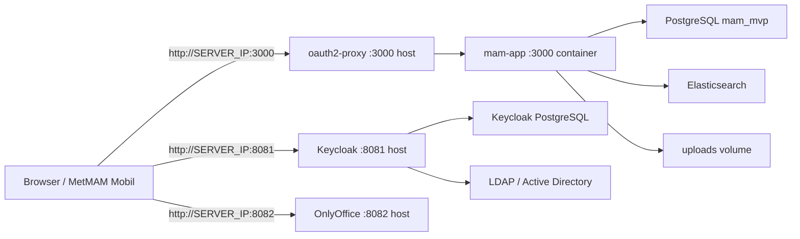

# MAM Deneme Şirket Server Kurulumu

Güncel tarih: 22.05.2026

Bu doküman `mam_deneme` uygulamasını şirket sunucusuna kurmak için güncel prosedürü anlatır. Bu sürüm doğrudan Docker Compose host portları üzerinden çalışacak şekilde hazırlanmıştır.

## 1. Mimari


```mermaid
flowchart LR
  U["Browser / MetMAM Mobil"] -->|http://SERVER_IP:3000| OP["oauth2-proxy :3000 host"]
  U -->|http://SERVER_IP:8081| KC["Keycloak :8081 host"]
  U -->|http://SERVER_IP:8082| OO["OnlyOffice :8082 host"]
  OP --> APP["mam-app :3000 container"]
  APP --> PG["PostgreSQL mam_mvp"]
  APP --> ES["Elasticsearch"]
  APP --> UP["uploads volume"]
  KC --> KCPG["Keycloak PostgreSQL"]
  KC --> LDAP["LDAP / Active Directory"]
```

Repo tarafında kalan servisler:
- `app`: MAM backend/frontend
- `oauth2-proxy`: Browser login koruması
- `keycloak`: OIDC ve LDAP entegrasyonu
- `postgres`: MAM DB
- `keycloak-postgres`: Keycloak DB
- `elasticsearch`: arama
- `onlyoffice`: opsiyonel Office edit
- `libreoffice`: opsiyonel offline doküman preview/görüntüleme akışı

Sunucuda dışarı açılan host portları:
- `3000`: MAM web ve API
- `8081`: Keycloak
- `8082`: OnlyOffice, sadece kullanılacaksa

## 2. DNS ve Public URL Planı

Doğrudan IP ile önerilen adresler:

```text
http://SERVER_IP:3000   -> MAM web ve API
http://SERVER_IP:8081   -> Keycloak
http://SERVER_IP:8082   -> OnlyOffice, sadece kullanılacaksa
```

MetMAM mobil uygulama ayarı:

```text
Host/IP:       http://SERVER_IP:3000
API base URL:  http://SERVER_IP:3000
OIDC issuer:   http://SERVER_IP:8081/realms/mam
```

## 3. Ağ Erişimi

Sunucuda şu portlar istemcilerden erişilebilir olmalıdır:

```text
SERVER_IP:3000   MAM
SERVER_IP:8081   Keycloak
SERVER_IP:8082   OnlyOffice
```

Önerilen limitler:
- MAM medya yüklemeleri için en az `20g` disk ve ağ yükü planlanmalı.
- Office dokümanları için OnlyOffice portu istemcilerden erişilebilir olmalı.

## 4. Server Gereksinimleri

Minimum öneri:
- Ubuntu Server 22.04 LTS veya 24.04 LTS
- Docker Engine
- Docker Compose plugin
- 4 CPU
- 16 GB RAM
- SSD disk

Pratik öneri:
- Orta kullanım: 8 CPU / 32 GB RAM / 1 TB SSD
- OCR/altyazı yoğun kullanım: daha fazla CPU/RAM veya ayrı worker mimarisi

## 5. Kurulum

Repo çekilir:

```bash
git clone https://github.com/takmasakal/mam_deneme.git
cd mam_deneme
git checkout takmasakal/kaisha
```

Kaisha ayar dosyası oluşturulur:

```bash
./deploy/mam-kaisha.sh init SERVER_IP
```

Bu komut şunu üretir:

```text
deploy/.env.kaisha
```

Servisler başlatılır. Bu komut Postgres secret değerini mevcut volume ile eşitleyerek eski kurulumlardan kalan parola uyuşmazlığını da düzeltir:

```bash
./deploy/mam-kaisha.sh up
```

Manuel Compose alternatifi kullanılacaksa önce Postgres parola sync adımı çalıştırılır:

```bash
docker compose --env-file deploy/.env.kaisha \
  -f docker-compose.yml \
  -f docker-compose.kaisha.yml \
  up -d postgres
./deploy/sync-postgres-password.sh --env-file deploy/.env.kaisha \
  -f docker-compose.yml \
  -f docker-compose.kaisha.yml
docker compose --env-file deploy/.env.kaisha \
  -f docker-compose.yml \
  -f docker-compose.kaisha.yml \
  up -d --build
```

URL kontrolü:

```bash
./deploy/mam-kaisha.sh urls
```

Servis kontrolü:

```bash
./deploy/mam-kaisha.sh ps
./deploy/mam-kaisha.sh logs app
./deploy/mam-kaisha.sh logs oauth2-proxy keycloak
```

## 6. Keycloak Production Notları

Doğrudan IP kurulumunda Keycloak public adresi `http://SERVER_IP:8081` olmalıdır.

`docker-compose.kaisha.yml` şu değerleri verir:

```yaml
KC_HOSTNAME: ${PUBLIC_KEYCLOAK_HOST}
KC_HOSTNAME_STRICT: "false"
KC_PROXY_HEADERS: xforwarded
KC_HTTP_ENABLED: "true"
```

Bunun anlamı:
- Keycloak HTTP olarak container içinde çalışır.
- Keycloak public URL ve issuer değerlerini `SERVER_IP:8081` üzerinden üretir.

## 7. Keycloak Client Ayarları

Realm: `mam`

Web client:

```text
Client ID: mam-web
Client authentication: On
Standard flow: On
Direct access grants: ihtiyaca göre Off/On
```

Redirect URI:

```text
http://SERVER_IP:3000/oauth2/callback
```

Post logout redirect URI:

```text
http://SERVER_IP:3000/*
```

Web origins:

```text
http://SERVER_IP:3000
```

Mobil client:

```text
Client ID: metmam-mobile
Client authentication: Off
Public client
Redirect URI: com.example.metmam:/oauth2redirect
```

## 8. LDAP / Active Directory

Keycloak Admin Console:

```text
Realm: mam
User federation -> Add LDAP provider
```

Önerilen yaklaşım:
- LDAP kullanıcıları Keycloak'a federated user olarak gelsin.
- LDAP dışı özel kullanıcılar Keycloak local user olarak oluşturulabilsin.
- Yetkiler LDAP grup mapper ile Keycloak grup/role yapısına taşınsın.

Önerilen LDAP grupları:

```text
mam-super-admin
mam-admin
mam-doc-admin
mam-text-admin
mam-user
```

MAM yetkileri:

```text
Super Admin: tüm yetkiler
Admin: yönetim sayfası dahil genel yönetim, ancak super-only işlemler hariç
Doc Admin: office.edit + pdf.advanced
OCR/Subtitle Admin: text.admin
Standard User: ek yönetim yetkisi yok
```

## 9. Offline Çalışma

Kurulum sonrası uygulama dışarıdan model indirmemeli.

Önemli env değerleri:

```text
MAM_OFFLINE_MODE=true
HF_HUB_OFFLINE=1
TRANSFORMERS_OFFLINE=1
PADDLE_OCR_ALLOW_FALLBACK=false
```

Model hazırlığı ilk kurulumda yapılmalı; GitHub'a model dosyası konmaz.

## 10. OnlyOffice / LibreOffice

Office web edit gerekiyorsa:

```text
OFFICE_EDITOR_PROVIDER=onlyoffice
ONLYOFFICE_PUBLIC_URL=http://SERVER_IP:8082
ONLYOFFICE_INTERNAL_URL=http://onlyoffice
```

Sadece offline read-only preview istenirse LibreOffice modu kullanılabilir. Ancak Word üzerinde web edit isteniyorsa OnlyOffice gerekir.

## 11. Diagnostik Komutları

Genel durum:

```bash
./deploy/mam-kaisha.sh ps
```

App logları:

```bash
./deploy/mam-kaisha.sh logs app
```

Keycloak logları:

```bash
./deploy/mam-kaisha.sh logs keycloak
```

OAuth2 proxy logları:

```bash
./deploy/mam-kaisha.sh logs oauth2-proxy
```

DB bağlantısı:

```bash
docker exec -it mam-postgres psql -U postgres -d mam_mvp
```

Public endpoint testleri doğrudan host portları üzerinden yapılmalı:

```bash
curl -I http://SERVER_IP:3000
curl -I http://SERVER_IP:8081/realms/mam
curl -I http://SERVER_IP:8082/web-apps/apps/api/documents/api.js
```

## 12. Güncelleme

```bash
git fetch origin
git checkout takmasakal/kaisha
git pull
./deploy/mam-kaisha.sh restart
```

## 13. Kaldırılan HTTPS Katmanı

Aşağıdakiler artık repo tarafından sağlanmaz:
- `docker-compose.kaisha-proxy.yml`
- repo içi Nginx container
- `deploy/nginx/*`
- `deploy/certs/*`
- repo içinde sertifika bağlama prosedürü

## 14. Yönetim Sayfası Backup Ayarları

Yönetim sayfasında `Ayarlar -> Yedekleme` bölümünden yedekleme yönetilir.

Seçenekler:
- Günlük yedeklemeyi aç/kapat
- Yedekleme dizini
- Günlük çalışma saati
- Saklama süresi
- MAM PostgreSQL dump
- Keycloak PostgreSQL dump
- Uploads arşivi
- Manuel `Şimdi Yedekle`

Önerilen NFS kullanımında backup dizini:

```text
/app/uploads/_backups
```

Eğer host tarafında NFS mount şöyleyse:

```text
/data/belgelik/uploads -> container /app/uploads
```

backup dosyaları host tarafında şurada görünür:

```text
/data/belgelik/uploads/_backups
```

Notlar:
- MAM DB ve Keycloak DB yedekleri `pg_dump -Fc` formatında üretilir.
- Uploads arşivi `.tar.gz` olarak üretilir ve `_backups` klasörü arşive dahil edilmez.
- Gerçek storage-level NFS snapshot uygulama içinden alınmaz; bu şirket storage/backup altyapısında ayrıca planlanmalıdır.
- DB ve Elasticsearch ana verisi NFS üstünde tutulmamalıdır; NFS sadece uploads/backup dosyaları için önerilir.
