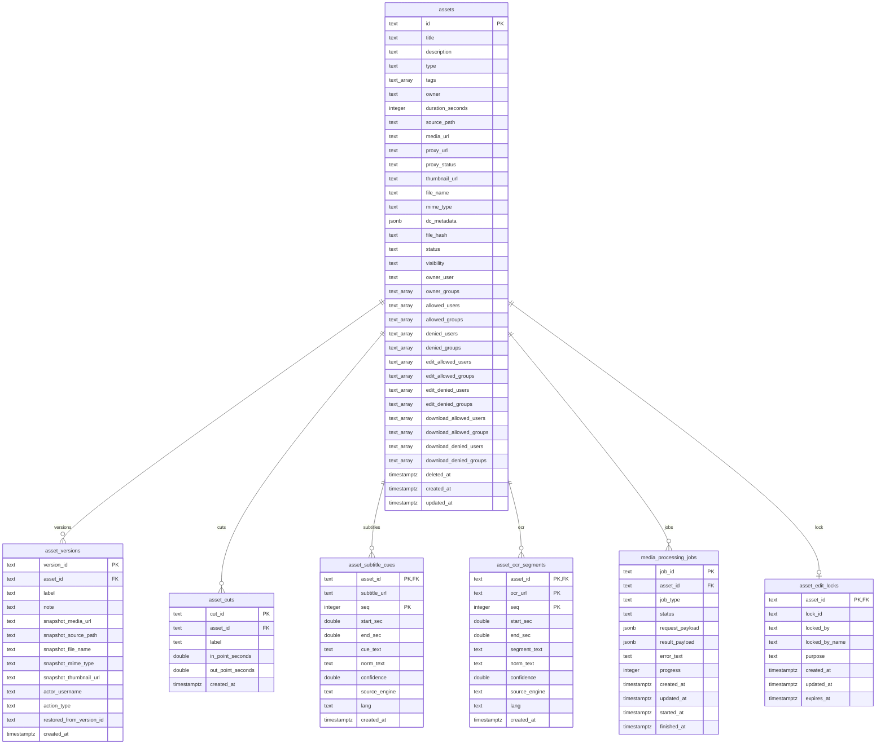
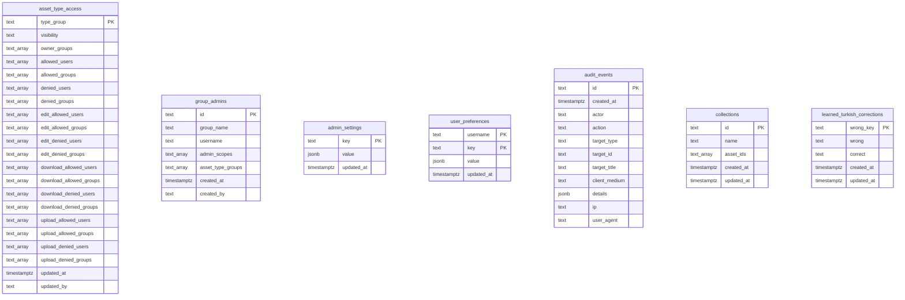

# MetMAM Database ERD

Kaynak: [src/db.js](/Users/erinc/OyunAlanım/mam_deneme/src/db.js)

Bu doküman mevcut PostgreSQL şemasının okunabilir ER diagramıdır. Canlı Docker veritabanına erişim olmadığında `src/db.js` içindeki `initDb()` tanımı kaynak alınmıştır. Profesyonel kullanımda kaynak gerçek veritabanı introspection çıktısı veya migration dosyaları olmalıdır; elle çizilen diagramlar zamanla hızla eskir.

## Core ERD



## Authorization And Settings



## Notable Design Notes

- `assets` uygulamanın merkez tablosudur; medya dosyası, görünürlük, sahiplik, indirme/düzenleme izinleri ve Dublin Core metadata aynı satırdadır.
- `asset_versions`, `asset_cuts`, `asset_subtitle_cues`, `asset_ocr_segments`, `media_processing_jobs` ve `asset_edit_locks` gerçek FK ile `assets(id)` alanına bağlıdır ve `ON DELETE CASCADE` kullanır.
- `collections.asset_ids` FK olmayan `TEXT[]` tutar. Profesyonel ilişkisel modelde bunun yerine `collection_assets(collection_id, asset_id)` gibi join table daha doğru olur.
- Yetki tabloları Keycloak kullanıcı/grup adlarını `TEXT` veya `TEXT[]` olarak tutar; Keycloak tarafına FK yoktur.
- `admin_settings`, `user_preferences`, `audit_events.details`, `media_processing_jobs.request_payload/result_payload` JSONB olduğu için esnek ama şema dışı veri taşır. Bu alanların formatı kod ve dokümantasyonla korunmalıdır.
- Arama performansı için `pg_trgm` extension ve GIN/trigram indexleri kullanılır.

## Important Indexes

- `assets`: `updated_at`, `deleted_at + updated_at`, `status`, `type`, `visibility`, `owner_user`, `file_hash`
- `assets`: `owner_groups`, `allowed_users`, `allowed_groups`, `download_allowed_users`, `download_allowed_groups`, `tags` için GIN index
- `assets`: `title`, `file_name`, `owner`, normalize edilmiş `title/file_name/owner/description` için trigram index
- `asset_cuts`: `asset_id + created_at`, normalize edilmiş `label` trigram index
- `asset_subtitle_cues`: `asset_id`, `asset_id + subtitle_url`, `asset_id + subtitle_url + start_sec`, `norm_text`, `norm_text` trigram
- `asset_ocr_segments`: `asset_id`, `asset_id + ocr_url`, `asset_id + ocr_url + start_sec`, `norm_text`, `norm_text` trigram
- `media_processing_jobs`: `asset_id + job_type + updated_at`, `status`, `updated_at`
- `audit_events`: `created_at`, `action`, `actor`, `client_medium`, `target_type + target_id`

## Professional Workflow

Profesyonel yaklaşımda diagram elle çizilmez; şema kaynağından otomatik üretilir.

1. Kaynak belirlenir:
   - En iyisi migration dosyalarıdır.
   - Migration yoksa canlı PostgreSQL introspection kullanılır.
   - Bu projede tablo yaratımı `src/db.js` içindeki `initDb()` fonksiyonunda olduğu için mevcut doküman buradan çıkarılmıştır.

2. Diagram formatı seçilir:
   - `Mermaid ERD`: GitHub ve Markdown içinde hızlı okunur.
   - `DBML`: dbdiagram.io gibi araçlarda daha iyi görsel çıktı verir.
   - `Graphviz`: büyük şemalarda otomatik layout için güçlüdür.
   - `PlantUML`: ekip dokümantasyonlarında ve CI çıktılarında kullanılabilir.

3. Tek büyük diagram yerine alanlara bölünür:
   - Core asset/media
   - Yetkilendirme
   - OCR/altyazı/iş kuyruğu
   - Audit/settings

4. Doküman güncel tutulur:
   - Migration veya `src/db.js` değiştiğinde ERD güncellenir.
   - İdeal durumda CI içinde diagram üretim scripti çalışır.

## Live Database Introspection Commands

Docker açıkken tablo listesini almak:

```bash
docker exec mam-postgres psql -U postgres -d mam_mvp -Atc "
SELECT table_name
FROM information_schema.tables
WHERE table_schema = 'public'
  AND table_type = 'BASE TABLE'
ORDER BY table_name;
"
```

Foreign key listesini almak:

```bash
docker exec mam-postgres psql -U postgres -d mam_mvp -c "
SELECT
  tc.table_name AS child_table,
  kcu.column_name AS child_column,
  ccu.table_name AS parent_table,
  ccu.column_name AS parent_column,
  tc.constraint_name
FROM information_schema.table_constraints tc
JOIN information_schema.key_column_usage kcu
  ON tc.constraint_name = kcu.constraint_name
 AND tc.table_schema = kcu.table_schema
JOIN information_schema.constraint_column_usage ccu
  ON ccu.constraint_name = tc.constraint_name
 AND ccu.table_schema = tc.table_schema
WHERE tc.constraint_type = 'FOREIGN KEY'
  AND tc.table_schema = 'public'
ORDER BY child_table, child_column;
"
```

Kolonları JSON olarak almak:

```bash
docker exec mam-postgres psql -U postgres -d mam_mvp -Atc "
SELECT jsonb_pretty(jsonb_agg(row_to_json(cols)::jsonb ORDER BY table_name, ordinal_position))
FROM (
  SELECT table_name, column_name, data_type, is_nullable, column_default, ordinal_position
  FROM information_schema.columns
  WHERE table_schema = 'public'
) cols;
"
```

Kaisha/Belgelik sunucusunda container adları farklıysa `mam-postgres` yerine `kaisha-postgres` kullanılmalıdır.
