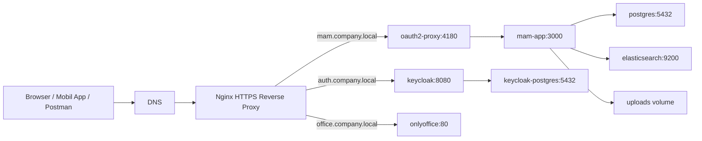

# MAM Deneme Şirket Kurulum Rehberi

Güncel tarih: 20.05.2026

Bu doküman `takmasakal/kaisha-reverse-proxy` branch'i ile MAM Deneme uygulamasını şirket sunucusuna HTTPS, Keycloak, OnlyOffice ve offline çalışmaya uygun şekilde kurmak için hazırlanmıştır.

Hedef kurulum:

```text
https://mam.company.local    -> MAM web + API
https://auth.company.local   -> Keycloak
https://office.company.local -> OnlyOffice Document Server
```

Amaçlar:

- Kullanıcıların IP/port yazmadan DNS adıyla erişmesi
- Web arayüzünde Office dokümanlarının düzenlenebilmesi
- API/Postman erişiminin tek web adresi + token ile çalışması
- Kurulumdan sonra güncelleme hariç dış internet ihtiyacı olmaması
- Dışarı sadece `80/443` portlarının açılması
- Keycloak, PostgreSQL, Elasticsearch, OnlyOffice gibi servislerin Docker network içinde kalması

---

## 1. Mimari



Dışarı açık portlar:

```text
80/tcp
443/tcp
```

Dışarı kapalı kalması gereken portlar:

```text
3000
3001
5432
8081
8082
9200
```

`docker-compose.kaisha-proxy.yml` bu portları kapatır ve sadece Nginx'i dışarı açar.

---

## 2. Ön Gereksinimler

Önerilen sunucu:

```text
OS: Ubuntu Server 22.04 LTS veya 24.04 LTS
CPU: en az 4 core, öneri 8 core
RAM: en az 16 GB, öneri 32 GB
Disk: SSD, upload alanına göre 500 GB+
Docker Engine
Docker Compose plugin
```

Kurulum paketleri:

```bash
sudo apt update
sudo apt install -y ca-certificates curl gnupg git openssl
```

Docker kurulu değilse şirket standardınıza göre kurun. Basit Docker kontrolü:

```bash
docker version
docker compose version
```

Docker daemon erişimi yoksa:

```bash
sudo usermod -aG docker $USER
newgrp docker
```

---

## 3. DNS Hazırlığı

Şirket DNS tarafında şu kayıtlar server IP'sine gitmelidir:

```text
mam.company.local     A  10.10.10.50
auth.company.local    A  10.10.10.50
office.company.local  A  10.10.10.50
```

Örnek test:

```bash
nslookup mam.company.local
nslookup auth.company.local
nslookup office.company.local
```

Beklenen: üçü de aynı şirket server IP'sini döndürür.

Mobil uygulama için ileride kullanılacak değerler:

```text
Host/IP:      https://mam.company.local
API base URL: https://mam.company.local
OIDC issuer:  https://auth.company.local/realms/mam
```

---

## 4. Sertifika Hazırlığı

Kurum CA'sından üç domain için sertifika alın:

```text
mam.company.local
auth.company.local
office.company.local
```

Wildcard sertifika varsa şu da uygundur:

```text
*.company.local
```

Dosya isimleri MAM kurulumunda şu şekilde beklenir:

```text
deploy/certs/mam.fullchain.pem
deploy/certs/mam.privkey.pem
deploy/certs/auth.fullchain.pem
deploy/certs/auth.privkey.pem
deploy/certs/office.fullchain.pem
deploy/certs/office.privkey.pem
```

Wildcard sertifika örneği:

```bash
cp wildcard.fullchain.pem deploy/certs/mam.fullchain.pem
cp wildcard.privkey.pem   deploy/certs/mam.privkey.pem
cp wildcard.fullchain.pem deploy/certs/auth.fullchain.pem
cp wildcard.privkey.pem   deploy/certs/auth.privkey.pem
cp wildcard.fullchain.pem deploy/certs/office.fullchain.pem
cp wildcard.privkey.pem   deploy/certs/office.privkey.pem
chmod 600 deploy/certs/*.privkey.pem
```

Sertifika kontrolü:

```bash
openssl x509 -in deploy/certs/mam.fullchain.pem -noout -subject -issuer -dates
openssl x509 -in deploy/certs/auth.fullchain.pem -noout -subject -issuer -dates
openssl x509 -in deploy/certs/office.fullchain.pem -noout -subject -issuer -dates
```

Private key ve certificate eşleşme kontrolü:

```bash
openssl x509 -noout -modulus -in deploy/certs/mam.fullchain.pem | openssl md5
openssl rsa  -noout -modulus -in deploy/certs/mam.privkey.pem   | openssl md5
```

İki hash aynı olmalıdır.

---

## 5. Online ve Offline Kurulum Yaklaşımı

### 5.1. Online ilk kurulum

Sunucunun internete çıkışı varsa ilk kurulumda Docker image'ları çekilir. Kurulumdan sonra runtime sırasında normal kullanım için internet gerekmemelidir.

### 5.2. Offline kurulum

Sunucunun internete çıkışı yoksa image'ları internet olan bir makinede hazırlayın.

Örnek image listesi:

```bash
docker pull nginx:1.27-alpine
docker pull postgres:16
docker pull quay.io/keycloak/keycloak:25.0
docker pull docker.elastic.co/elasticsearch/elasticsearch:8.13.4
docker pull onlyoffice/documentserver:8.3
```

MAM app image kullanıyorsanız:

```bash
docker pull takmasakal/mam:1.0.0
```

Tar'a aktarın:

```bash
docker save -o mam-company-images.tar \
  nginx:1.27-alpine \
  postgres:16 \
  quay.io/keycloak/keycloak:25.0 \
  docker.elastic.co/elasticsearch/elasticsearch:8.13.4 \
  onlyoffice/documentserver:8.3 \
  takmasakal/mam:1.0.0
```

Şirket server'da yükleyin:

```bash
docker load -i mam-company-images.tar
```

Kontrol:

```bash
docker images | grep -E 'nginx|postgres|keycloak|elasticsearch|onlyoffice|takmasakal/mam'
```

Not: Eğer `docker compose build` ile lokal build yapılacaksa Node/Python paketleri ve ML/OCR modelleri build sırasında indirilebilir. Tam offline kurulum için image'ı önceden build edip `docker save/load` ile taşımak daha güvenlidir.

---

## 6. Kodu İndirme

Kurulum dizini:

```bash
sudo mkdir -p /opt/mam_deneme
sudo chown -R $USER:$USER /opt/mam_deneme
cd /opt/mam_deneme
```

Repo:

```bash
git clone https://github.com/takmasakal/mam_deneme.git .
git switch takmasakal/kaisha-reverse-proxy
```

Güncelleme için:

```bash
cd /opt/mam_deneme
git pull
```

---

## 7. Storage Planı

Upload dizini:

```bash
sudo mkdir -p /srv/mam/uploads
sudo chown -R $USER:$USER /srv/mam/uploads
```

Backup dizini:

```bash
sudo mkdir -p /srv/mam/backups
sudo chown -R $USER:$USER /srv/mam/backups
```

İsteğe bağlı olarak `deploy/.env.kaisha` içine şu değer eklenebilir:

```bash
UPLOADS_DIR=/srv/mam/uploads
```

Mevcut `docker-compose.yml` lokal kurulumda `./uploads:/app/uploads` kullanır. Şirket kurulumunda kalıcı storage için ayrıca compose override ile `/srv/mam/uploads:/app/uploads` bağlamak daha doğru olur. Bunu ayrı bir storage override dosyasıyla yönetebilirsiniz.

Örnek `docker-compose.kaisha-storage.yml`:

```yaml
services:
  app:
    volumes:
      - /srv/mam/uploads:/app/uploads
```

Başlatırken:

```bash
docker compose --env-file deploy/.env.kaisha \
  -f docker-compose.yml \
  -f docker-compose.kaisha-proxy.yml \
  -f docker-compose.kaisha-storage.yml \
  up -d
```

---

## 8. Şirket Ortam Dosyasını Oluşturma

Komut:

```bash
./deploy/mam-kaisha.sh init mam.company.local auth.company.local office.company.local
```

Bu dosyaları üretir:

```text
deploy/.env.kaisha
deploy/nginx/mam-https.conf
```

Örnek `deploy/.env.kaisha` içeriği:

```bash
PUBLIC_HOST=mam.company.local
PUBLIC_MAM_HOST=mam.company.local
PUBLIC_KEYCLOAK_HOST=auth.company.local
PUBLIC_OFFICE_HOST=office.company.local
PUBLIC_MAM_URL=https://mam.company.local
PUBLIC_KEYCLOAK_URL=https://auth.company.local
PUBLIC_OFFICE_URL=https://office.company.local
PUBLIC_MAM_URL_ENCODED=https%3A%2F%2Fmam.company.local

KEYCLOAK_REALM=mam
KEYCLOAK_REALMS=mam
KEYCLOAK_ADMIN_REALM=master
KEYCLOAK_DB_USER=keycloak
KEYCLOAK_DB_NAME=keycloak
OAUTH2_PROXY_CLIENT_ID=mam-web
OAUTH2_PROXY_WHITELIST_DOMAINS=.company.local

OFFICE_EDITOR_PROVIDER=onlyoffice
ONLYOFFICE_PUBLIC_URL=https://office.company.local
ONLYOFFICE_INTERNAL_URL=http://onlyoffice
APP_INTERNAL_URL=http://app:3000

MAM_OFFLINE_MODE=true
HF_HUB_OFFLINE=1
TRANSFORMERS_OFFLINE=1
PADDLE_OCR_ALLOW_FALLBACK=false
```

Private key ve secrets dosyaları git'e alınmaz.

---

## 9. Docker Secrets

İlk init sırasında `deploy/secrets/` dizini oluşur. Örnek dosyalar:

```text
deploy/secrets/mam_postgres_password
deploy/secrets/keycloak_db_password
deploy/secrets/keycloak_admin_password
deploy/secrets/oauth2_proxy_client_secret
deploy/secrets/oauth2_proxy_cookie_secret
deploy/secrets/mam_admin_password
deploy/secrets/mam_user_password
deploy/secrets/mam_text_admin_password
```

İzinleri kontrol edin:

```bash
ls -la deploy/secrets
chmod 700 deploy/secrets
chmod 600 deploy/secrets/*
```

Secret görüntüleme örneği:

```bash
cat deploy/secrets/keycloak_admin_password
```

Üretim ortamında bu dosyaları sadece yetkili sistem yöneticisi görebilmelidir.

Daha detaylı bilgi:

```text
docs/docker-secrets.md
```

---

## 10. Başlatma

Sertifikalar hazırlandıktan sonra:

```bash
./deploy/mam-kaisha.sh up
```

Manuel karşılığı:

```bash
docker compose --env-file deploy/.env.kaisha \
  -f docker-compose.yml \
  -f docker-compose.kaisha-proxy.yml \
  up -d
```

Durum kontrolü:

```bash
./deploy/mam-kaisha.sh ps
```

Loglar:

```bash
./deploy/mam-kaisha.sh logs nginx oauth2-proxy keycloak app onlyoffice
```

URL çıktısı:

```bash
./deploy/mam-kaisha.sh urls
```

---

## 11. Keycloak İlk Kontrol

Keycloak admin URL:

```text
https://auth.company.local
```

Admin kullanıcı adı:

```text
KEYCLOAK_ADMIN
```

Admin şifresi:

```bash
cat deploy/secrets/keycloak_admin_password
```

Keycloak hazır mı:

```bash
curl -vk https://auth.company.local/realms/mam/.well-known/openid-configuration
```

Beklenen: JSON döner.

---

## 12. Keycloak Client Ayarları

Realm:

```text
mam
```

Client:

```text
mam-web
```

Ayarlar:

```text
Client authentication: On
Standard flow: On
Direct access grants: gerekmiyorsa Off, mobil password flow kullanılacaksa On
```

Redirect:

```text
Valid redirect URIs:
https://mam.company.local/oauth2/callback
```

Post logout:

```text
Valid post logout redirect URIs:
https://mam.company.local/*
```

Web origins:

```text
https://mam.company.local
```

Mobil client varsa:

```text
Client ID: metmam-mobile
Redirect URI: com.example.metmam:/oauth2redirect
```

---

## 13. LDAP / Active Directory Entegrasyonu

Keycloak Admin Console:

```text
Realm: mam
User Federation
Add provider
ldap
```

Örnek LDAP ayarları:

```text
Vendor: Active Directory
Connection URL: ldap://ad.company.local:389
Users DN: OU=Users,DC=company,DC=local
Bind DN: CN=svc_mam_ldap,OU=Service Accounts,DC=company,DC=local
Bind Credential: servis hesabı şifresi
Username LDAP attribute: sAMAccountName
RDN LDAP attribute: cn
UUID LDAP attribute: objectGUID
User object classes: person, organizationalPerson, user
```

Grup mapping:

```text
Mappers > Create
Mapper type: group-ldap-mapper
LDAP Groups DN: OU=Groups,DC=company,DC=local
Group Name LDAP Attribute: cn
Membership LDAP Attribute: member
Membership User LDAP Attribute: distinguishedName
Mode: READ_ONLY veya LDAP_ONLY
```

Önerilen LDAP grup isimleri:

```text
MAM-SuperAdmin
MAM-Admin
MAM-DocAdmin
MAM-OcrTitleAdmin
MAM-Users
```

MAM yetki karşılıkları:

```text
Super Admin       -> tüm yetkiler
Admin             -> yönetim sayfası hariç operasyon yetkileri
Doc Admin         -> office.edit + pdf.advanced
OCRTitle Admin    -> text.admin
Standart User     -> ek yetki yok
```

Bu yetkiler MAM Yönetim sayfasında Kullanıcı Ayarları ve Varlık Yetkileri üzerinden yönetilir.

---

## 14. OnlyOffice Offline Web Edit

Web arayüzünde Office edit için OnlyOffice gerekir. Bu kurulumda public URL:

```text
https://office.company.local
```

MAM env:

```bash
OFFICE_EDITOR_PROVIDER=onlyoffice
ONLYOFFICE_PUBLIC_URL=https://office.company.local
ONLYOFFICE_INTERNAL_URL=http://onlyoffice
APP_INTERNAL_URL=http://app:3000
```

Test:

```bash
curl -vk https://office.company.local/web-apps/apps/api/documents/api.js
```

Beklenen: JavaScript içeriği döner.

OnlyOffice runtime sırasında internet gerektirmez. Gerekli image ilk kurulumda ya da offline `docker load` ile yüklenmiş olmalıdır.

---

## 15. API / Postman Kullanımı

API artık aynı web adresinden çalışır. Cookie kopyalamaya gerek yoktur.

Token yeri:

```text
MAM > Yönetim > Ayarlar > Token & OIDC > API Token
```

Postman örneği:

```http
GET https://mam.company.local/api/assets?q=istanbul
X-API-Token: <token>
```

Alternatif header:

```http
X-MAM-API-Token: <token>
```

cURL örneği:

```bash
curl -sS "https://mam.company.local/api/assets?q=istanbul" \
  -H "X-API-Token: <token>"
```

Tokensız test:

```bash
curl -vk https://mam.company.local/api/me
```

Beklenen HTML değil JSON olmalıdır:

```json
{"error":"Missing API token"}
```

Token ile:

```bash
curl -sS https://mam.company.local/api/me \
  -H "X-API-Token: <token>"
```

---

## 16. Mobil App Ayarları

Metmam mobil app için:

```text
Host/IP:      https://mam.company.local
API base URL: https://mam.company.local
OIDC issuer:  https://auth.company.local/realms/mam
```

Mobil client Keycloak'ta yoksa `client_not_found` alınır. `metmam-mobile` client'ı oluşturulmalı ve redirect URI doğru girilmelidir.

---

## 17. Günlük Yönetim Komutları

Başlat:

```bash
./deploy/mam-kaisha.sh up
```

Durdur:

```bash
./deploy/mam-kaisha.sh down
```

Yeniden başlat:

```bash
./deploy/mam-kaisha.sh restart
```

Durum:

```bash
./deploy/mam-kaisha.sh ps
```

Log:

```bash
./deploy/mam-kaisha.sh logs
./deploy/mam-kaisha.sh logs app
./deploy/mam-kaisha.sh logs nginx oauth2-proxy keycloak onlyoffice
```

---

## 18. Diagnostik

Nginx config:

```bash
docker compose --env-file deploy/.env.kaisha \
  -f docker-compose.yml \
  -f docker-compose.kaisha-proxy.yml \
  exec nginx nginx -t
```

HTTPS MAM:

```bash
curl -vk https://mam.company.local/
```

API token zorunluluğu:

```bash
curl -vk https://mam.company.local/api/me
```

Keycloak discovery:

```bash
curl -vk https://auth.company.local/realms/mam/.well-known/openid-configuration
```

OnlyOffice script:

```bash
curl -vk https://office.company.local/web-apps/apps/api/documents/api.js
```

Container servisleri:

```bash
docker compose --env-file deploy/.env.kaisha \
  -f docker-compose.yml \
  -f docker-compose.kaisha-proxy.yml \
  ps
```

Port kontrolü:

```bash
sudo ss -lntp | grep -E ':80|:443|:3000|:8081|:8082|:5432|:9200'
```

Beklenen: dış host tarafında sadece `80` ve `443` görünür. Docker internal portları host'a publish edilmemelidir.

---

## 19. Backup

PostgreSQL backup:

```bash
mkdir -p /srv/mam/backups

docker compose --env-file deploy/.env.kaisha \
  -f docker-compose.yml \
  -f docker-compose.kaisha-proxy.yml \
  exec -T postgres pg_dump -U postgres mam_mvp \
  > /srv/mam/backups/mam_mvp_$(date +%Y%m%d_%H%M%S).sql
```

Keycloak DB backup:

```bash
docker compose --env-file deploy/.env.kaisha \
  -f docker-compose.yml \
  -f docker-compose.kaisha-proxy.yml \
  exec -T keycloak-postgres pg_dump -U keycloak keycloak \
  > /srv/mam/backups/keycloak_$(date +%Y%m%d_%H%M%S).sql
```

Uploads backup:

```bash
rsync -a --delete /srv/mam/uploads/ /srv/mam/backups/uploads_snapshot/
```

Secrets backup:

```bash
tar czf /srv/mam/backups/mam_secrets_$(date +%Y%m%d_%H%M%S).tar.gz deploy/secrets
chmod 600 /srv/mam/backups/mam_secrets_*.tar.gz
```

---

## 20. Güncelleme

Kod güncelleme:

```bash
cd /opt/mam_deneme
git pull
./deploy/mam-kaisha.sh restart
```

Image güncelleme online ortamda:

```bash
docker compose --env-file deploy/.env.kaisha \
  -f docker-compose.yml \
  -f docker-compose.kaisha-proxy.yml \
  pull
./deploy/mam-kaisha.sh restart
```

Offline ortamda yeni image'lar başka makinede hazırlanır:

```bash
docker save -o mam-company-images-new.tar ...
```

Sunucuda:

```bash
docker load -i mam-company-images-new.tar
./deploy/mam-kaisha.sh restart
```

---

## 21. Yaygın Hatalar

### 21.1. Browser login sonrası redirect_uri hatası

Keycloak client ayarını kontrol edin:

```text
Valid redirect URIs:
https://mam.company.local/oauth2/callback
```

### 21.2. Postman HTML dönüyor

Beklenen API cevabı JSON olmalı. Eğer HTML dönüyorsa `/api` oauth2-proxy tarafından app'e geçirilmemiştir.

Kontrol:

```bash
./deploy/mam-kaisha.sh logs oauth2-proxy
```

Logda şu satırlar görünmelidir:

```text
Skipping auth - Path: ^/api/.*
```

### 21.3. OnlyOffice script yüklenemedi

Kontrol:

```bash
curl -vk https://office.company.local/web-apps/apps/api/documents/api.js
```

`ONLYOFFICE_PUBLIC_URL` doğru mu:

```bash
grep ONLYOFFICE_PUBLIC_URL deploy/.env.kaisha
```

### 21.4. Office edit save çalışmıyor

Callback için MAM app internal URL doğru olmalı:

```bash
APP_INTERNAL_URL=http://app:3000
ONLYOFFICE_INTERNAL_URL=http://onlyoffice
```

OnlyOffice container logları:

```bash
./deploy/mam-kaisha.sh logs onlyoffice
```

### 21.5. Sertifika hatası

Sertifika domain'i ve key eşleşmesini kontrol edin:

```bash
openssl x509 -in deploy/certs/mam.fullchain.pem -noout -subject -issuer -dates
openssl x509 -noout -modulus -in deploy/certs/mam.fullchain.pem | openssl md5
openssl rsa  -noout -modulus -in deploy/certs/mam.privkey.pem   | openssl md5
```

---

## 22. Kurulum Özeti

Kısa yol:

```bash
sudo mkdir -p /opt/mam_deneme /srv/mam/uploads /srv/mam/backups
sudo chown -R $USER:$USER /opt/mam_deneme /srv/mam/uploads /srv/mam/backups
cd /opt/mam_deneme

git clone https://github.com/takmasakal/mam_deneme.git .
git switch takmasakal/kaisha-reverse-proxy

./deploy/mam-kaisha.sh init mam.company.local auth.company.local office.company.local

# Sertifikaları deploy/certs altına koyun.

./deploy/mam-kaisha.sh up
./deploy/mam-kaisha.sh ps
./deploy/mam-kaisha.sh logs nginx oauth2-proxy keycloak app onlyoffice
```

Tarayıcı:

```text
https://mam.company.local
```

Keycloak:

```text
https://auth.company.local
```

OnlyOffice:

```text
https://office.company.local
```
