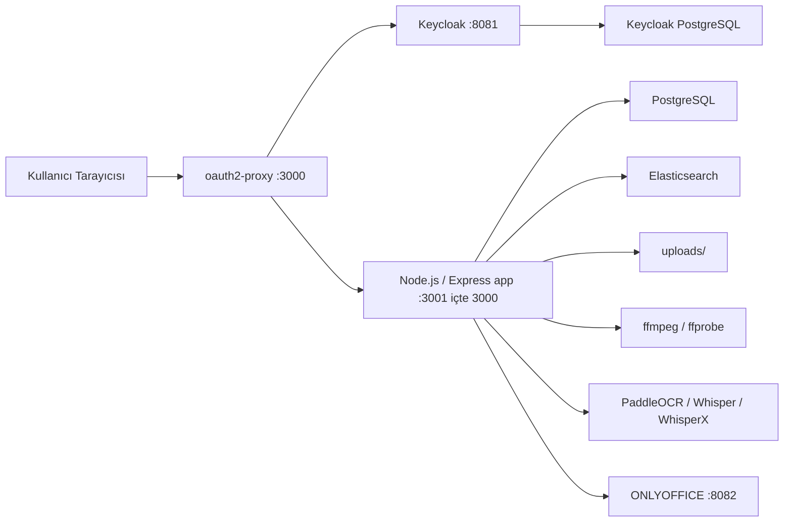

# MAM Deneme Teknik Referans

Tarih: 2026-04-13  
Proje yolu: `/Users/erinc/OyunAlanım/mam_deneme`

Bu doküman `mam_deneme` uygulamasının teknik çalışma mantığını, kod haritasını, Docker mimarisini, teşhis komutlarını ve bileşen güncelleme prosedürlerini tek yerde toplar.

Amaç:
- sistemi ilk kez devralan geliştiricinin hızlı onboarding alması
- arıza anında hangi komutların çalıştırılacağını bilmek
- Docker yapısını bozmadan servis güncellemesi yapabilmek
- büyük dosya olan `src/server.js` dahil ana iş mantığını parça parça anlamlandırmak

## 1. Sistem Özeti

`mam_deneme`, tek repo içinde çalışan bir MAM prototipidir. Ana yetenekleri:
- medya ingest
- metadata yönetimi
- arama
- soft delete / restore / permanent delete
- video proxy üretimi
- thumbnail üretimi
- subtitle üretimi ve aranması
- video OCR üretimi ve aranması
- versioning
- Keycloak tabanlı login
- ONLYOFFICE ile Office belge düzenleme

Uygulama hem frontend hem backend olarak tek Node.js servisi içinde çalışır. Auth, arama ve doküman servisleri ayrı container’larda tutulur.

## 2. Yüksek Seviye Mimari



## 3. Çalışma Modları

### 3.1 Normal Docker Compose modu
Ana dosya: [docker-compose.yml](/Users/erinc/OyunAlanım/mam_deneme/docker-compose.yml)

Portlar:
- `3000` -> `oauth2-proxy`
- `3001` -> `app`
- `8081` -> `keycloak`
- `8082` -> `onlyoffice`
- `9200` -> `elasticsearch`
- `5432` -> `postgres`

Not:
- son kullanıcı için doğru giriş noktası `3000` portudur
- `3001` doğrudan app portudur; auth bypass ettiği için günlük kullanım adresi olmamalıdır

### 3.2 Turnkey / easy deploy modu
İlgili dosyalar:
- [docker-compose.easy.yml](/Users/erinc/OyunAlanım/mam_deneme/docker-compose.easy.yml)
- [deploy/init.sh](/Users/erinc/OyunAlanım/mam_deneme/deploy/init.sh)
- [deploy/mam.sh](/Users/erinc/OyunAlanım/mam_deneme/deploy/mam.sh)

Bu mod, Keycloak realm import ve env üretimini otomatikleştirir.

### 3.3 RPi modu
İlgili dosyalar:
- [docker-compose.rpi.yml](/Users/erinc/OyunAlanım/mam_deneme/docker-compose.rpi.yml)
- [deploy/init-rpi.sh](/Users/erinc/OyunAlanım/mam_deneme/deploy/init-rpi.sh)
- [deploy/mam-rpi.sh](/Users/erinc/OyunAlanım/mam_deneme/deploy/mam-rpi.sh)

Bu mod RPi / düşük kaynaklı cihazlar için ayrı bir kurulum akışı sağlar.

## 4. Kod Haritası

## 4.1 Backend dosyaları

### [src/server.js](/Users/erinc/OyunAlanım/mam_deneme/src/server.js)
Bu dosya sistemin ana beyni. Express uygulaması, route’lar, media işleme, arama, OCR, subtitle, admin araçları ve auth entegrasyonunun büyük bölümü burada.

Ana sorumluluk alanları:
- OIDC / Keycloak yardımcıları
- Elasticsearch yardımcıları
- text search parser’ları
- subtitle parser ve index senkronizasyonu
- OCR parser ve index senkronizasyonu
- media processing job yönetimi
- ingest path üretimi
- thumbnail / PDF / Office yardımcıları
- duplicate file hash kontrolü
- asset cleanup ve orphan benzeri disk ilişkileri
- Express route’ları

Önemli fonksiyon kümeleri:

#### Auth / OIDC
- `buildRealmIssuerUrl`
- `buildRealmJwksUrl`
- `buildLogoutUrl`
- `getBearerFromRequest`
- `hasAuthenticatedUpstreamUser`

Bunlar Keycloak ve `oauth2-proxy` ile gelen isteklerin doğru issuer / logout / header mantığında çözümlenmesini sağlar.

#### Elasticsearch
- `elasticRequest`
- `ensureElasticIndex`
- `buildAssetSearchDoc`
- `indexAssetToElastic`
- `removeAssetFromElastic`
- `searchAssetIdsElastic`
- `suggestAssetIdsElastic`
- `backfillElasticIndex`

Bu blok, asset kayıtlarının Elasticsearch’e nasıl yazıldığını ve text aramada hangi ID setinin döndürüldüğünü yönetir.

#### Genel text search parser
- `parseSearchTokens`
- `parseTextSearchQuery`
- `tokenizeSearchTokens`
- `fuzzySearchTokenMatch`
- `fuzzySearchTextMatch`
- `suggestDidYouMeanFromTexts`
- `exactNormalizedTextRegex`

Bu bölüm normal arama alanındaki:
- `+must include`
- `-must exclude`
- quoted exact phrase
- fuzzy / did-you-mean
mantığını üretir.

#### OCR arama ve OCR işleme
- `normalizeComparableOcr`
- `extractOcrMatchLines`
- `findOcrMatchesInRow`
- `loadActiveOcrSegmentsForAssetRow`
- `searchOcrMatchesForAssetRow`
- `syncOcrSegmentIndexForAsset`
- `saveAssetVideoOcrMetadata`
- `extractVideoOcrToText`
- `prepareOcrFrames`
- `extractVideoOcrFrameTextPaddle`

Bu blok hem OCR üretimini hem de OCR aramasını yönetir.

#### Subtitle arama ve subtitle üretimi
- `parseSubtitleTextSearchQuery`
- `buildSubtitleCueSearchWhereSql`
- `subtitleCueMatchesParsedQuery`
- `suggestSubtitleDidYouMean`
- `searchSubtitleMatchesForAssetRow`
- `syncSubtitleCueIndexForAssetRow`
- `ensureSubtitleCueIndexForAssetRow`
- `transcribeMediaToVtt`
- `saveAssetSubtitleMetadata`

Bu bölüm altyazı oluşturma, VTT/SRT normalizasyonu ve arama tarafını taşır.

#### Disk path / ingest / artifacts
- `getIngestStoragePath`
- `artifactRoot`
- `buildArtifactPath`
- `resolveStoredUrl`
- `publicUploadUrlToAbsolutePath`
- `resolveAssetInputPath`

Bu fonksiyonlar hangi dosyanın `uploads/` altında nereye yazılacağını belirler.

#### Duplicate / hash / cleanup
- `computeBufferSha256`
- `computeFileSha256`
- `persistAssetFileHash`
- `getAssetStoredFileHash`
- `findDuplicateAssetByHash`
- `collectAssetCleanupPaths`
- `cleanupAssetFiles`

Bu bloklar:
- aynı içeriğin tekrar tekrar ingest edilmesini önleme
- asset silinince related dosyaları diskten de silme
mantığını yürütür.

#### Asset mapping / create / workflow
- `mapAssetRow`
- `mapVersionRow`
- `mapCutRow`
- `createAssetRecord`
- `generateVideoProxy`
- `runFfmpeg`
- `queueVideoOcrJob`
- `queueSubtitleGenerationJob`

Bu bölüm DB satırlarını frontend’in beklediği shape’e çevirir ve ingest sonrası üretim akışlarını başlatır.

#### Admin settings / permissions
- `getAdminSettings`
- `saveAdminSettings`
- `getUserPermissionsSettings`
- `saveUserPermissionsSettings`

Bunlar admin panelindeki kalıcı ayarları saklar.

### [src/db.js](/Users/erinc/OyunAlanım/mam_deneme/src/db.js)
Bu dosya DB bağlantı havuzunu kurar ve başlangıç migration benzeri `CREATE TABLE IF NOT EXISTS` bloğunu çalıştırır.

Ana görevleri:
- `DATABASE_URL` çözümleme
- `pg.Pool` oluşturma
- `initDb()` ile schema bootstrap

Burada tanımlanan temel tablolar:
- `assets`
- `asset_versions`
- `asset_cuts`
- `collections`
- `asset_subtitle_cues`
- `asset_ocr_segments`
- `media_processing_jobs`
- `admin_settings`
- `learned_turkish_corrections`

### [src/permissions.js](/Users/erinc/OyunAlanım/mam_deneme/src/permissions.js)
İzin modelini ve kullanıcı yetki çözümünü yönetir.

Özet:
- rol -> permission map
- local permission override’ları
- admin page / delete / metadata edit gibi capability çözümü

### Python medya işleme dosyaları
- [src/transcribe_whisper.py](/Users/erinc/OyunAlanım/mam_deneme/src/transcribe_whisper.py)
- [src/transcribe_whisperx.py](/Users/erinc/OyunAlanım/mam_deneme/src/transcribe_whisperx.py)
- [src/video_ocr_frame_prep.py](/Users/erinc/OyunAlanım/mam_deneme/src/video_ocr_frame_prep.py)
- [src/video_ocr_paddle.py](/Users/erinc/OyunAlanım/mam_deneme/src/video_ocr_paddle.py)

Rolleri:
- Whisper / WhisperX ile transcription
- OCR için frame prep
- PaddleOCR ile metin çıkarımı

## 4.2 Frontend dosyaları

### [public/index.html](/Users/erinc/OyunAlanım/mam_deneme/public/index.html)
Ana SPA benzeri sayfa.

Bölümler:
- panel 1: ingest / search
- panel 2: asset listesi
- panel 3: detail panel

### [public/main.js](/Users/erinc/OyunAlanım/mam_deneme/public/main.js)
Tüm frontend davranışının ana dosyasıdır.

Ana sorumluluklar:
- i18n sözlükleri ve dil değişimi
- asset list render
- detail panel render
- video / audio / image / document viewer
- OCR / subtitle / metadata / version / cuts etkileşimi
- admin olmayan ana kullanıcı akışı
- player kontrolleri
- detail panel player yerleşimi

Önemli frontend fonksiyon kümeleri:

#### UI ve panel yerleşimi
- panel resize / hide mantıkları
- 3 kolon layout güncellemeleri
- detail mode / pinned video mode sınıfları

#### Viewer oluşturma
- `mediaViewer(...)`
- `detailMarkup(...)`
- asset tipine göre uygun preview / player / PDF / office viewer bağlama

#### Video player kontrolü
- `initFrameControls(...)`
- `initCustomVideoControls(...)`
- `initAudioTools(...)`
- `initPlaybackRateLongPress(...)` adı korunmuş olsa da artık `TC` yanındaki `◀ 1x ▶` hız kontrolünü yönetir

Not:
- Safari’de ses bozulması / pause loop sorunu için `initAudioTools(...)` içinde Safari bypass uygulanmıştır; playback sırasında audio graph kurulmaması hedeflenmiştir.

#### Search UI
- arama query state yönetimi
- did-you-mean butonları
- fuzzy highlight sınıfları
- OCR / subtitle / global search sonuç render

### [public/styles.css](/Users/erinc/OyunAlanım/mam_deneme/public/styles.css)
Ana CSS dosyası.

İçeriği:
- üç kolon layout
- detail panel stilleri
- asset kartları
- search hit blokları
- subtitle / OCR highlight stilleri
- player controls
- `TC + ◀ 1x ▶` yerleşimi

### [public/admin.html](/Users/erinc/OyunAlanım/mam_deneme/public/admin.html)
Admin paneli HTML iskeleti.

### [public/admin.js](/Users/erinc/OyunAlanım/mam_deneme/public/admin.js)
Admin ekranı davranışı.

İçeriği:
- settings sekmeleri
- proxy tools
- user permissions ayarları
- maintenance benzeri ekran akışları

### [public/i18n.json](/Users/erinc/OyunAlanım/mam_deneme/public/i18n.json)
Frontend çeviri yükleme kaynağı.

Not:
- bazı başlıkların [public/main.js](/Users/erinc/OyunAlanım/mam_deneme/public/main.js) içindeki local i18n sözlüklerinden farklı görünmesi durumunda override kaynağı burası olabilir.

## 4.3 Deploy / script dosyaları

### [scripts/up_latest_main.sh](/Users/erinc/OyunAlanım/mam_deneme/scripts/up_latest_main.sh)
Amaç:
- `main` branch’in en son halini çekmek
- dış Postgres volume’u garanti etmek
- `docker compose up -d --build` çalıştırmak

Kullanım:
```bash
./scripts/up_latest_main.sh
```

### [scripts/up-fast.sh](/Users/erinc/OyunAlanım/mam_deneme/scripts/up-fast.sh)
Amaç:
- daha hızlı rebuild akışı

### [scripts/report_orphan_uploads.js](/Users/erinc/OyunAlanım/mam_deneme/scripts/report_orphan_uploads.js)
Amaç:
- DB’de referansı olmayan upload dosyalarını raporlamak
- orphan cleanup öncesi analiz yapmak

### [deploy/init.sh](/Users/erinc/OyunAlanım/mam_deneme/deploy/init.sh)
Easy deploy için env ve Keycloak realm import dosyalarını üretir.

### [deploy/mam.sh](/Users/erinc/OyunAlanım/mam_deneme/deploy/mam.sh)
Easy deploy için wrapper komutudur.

## 5. Veri Akışları

## 5.1 Login akışı
1. kullanıcı `http://localhost:3000`
2. istek `oauth2-proxy`ye gelir
3. login yoksa Keycloak’a redirect edilir
4. callback sonrası `oauth2-proxy` upstream olarak `app` servisine geçirir
5. backend auth header’larından kullanıcıyı çözer

## 5.2 Video upload akışı
1. frontend base64 payload gönderir
2. backend dosyayı `uploads/YYYY-MM-DD/<type>/...` altına yazar
3. SHA-256 hash hesaplanır
4. duplicate file hash varsa `409 duplicate_asset_content`
5. gerekiyorsa ffmpeg ile proxy / thumbnail üretimi başlar
6. asset DB kaydı oluşturulur
7. Elasticsearch index güncellenir

## 5.3 Subtitle akışı
1. user subtitle upload eder veya generate başlatır
2. VTT/SRT normalize edilir
3. `asset_subtitle_cues` index tablosu doldurulur
4. query parser ile arama yapılır
5. hit’ler frontend’de render edilir

## 5.4 OCR akışı
1. frame prep yapılır
2. OCR engine çalışır
3. segment text normalleştirilir
4. `asset_ocr_segments` index tablosu doldurulur
5. OCR search parser ile aranır

## 5.5 Office / PDF akışı
1. asset Office/PDF ise viewer açılır
2. ONLYOFFICE callback veya PDF save route’u işlenir
3. gerekirse version kaydı oluşturulur
4. asset satırı yeni path / file hash ile güncellenir

## 6. Docker Yapısı

## 6.1 Servisler ve görevleri

### `postgres`
- ana uygulama DB’si
- asset metadata ve iş kayıtları burada

### `elasticsearch`
- full text / suggestion altyapısı

### `app`
- Node.js backend + static frontend
- ffmpeg / OCR / whisper bağımlılıkları burada

### `onlyoffice`
- Office belge preview/edit

### `keycloak-postgres`
- Keycloak’un kendi DB’si

### `keycloak`
- auth ve realm yönetimi

### `oauth2-proxy`
- `3000` giriş kapısı
- OIDC callback, cookie, logout akışı

## 6.2 Dockerfile
Ana dosya: [Dockerfile](/Users/erinc/OyunAlanım/mam_deneme/Dockerfile)

Mantık:
- base image: `node:22-bookworm-slim`
- system deps: `ffmpeg`, `poppler-utils`, `antiword`, `python3`, `pip`
- Python deps:
  - `faster-whisper`
  - `opencv-python-headless`
  - `numpy`
  - `torch`
  - `torchaudio`
  - `whisperx`
  - desteklenen mimaride `paddleocr`, `paddlepaddle`
- Node deps: `npm ci --omit=dev`
- runtime: `npm start`

## 7. Diagnostik Komutlar

Aşağıdaki komutlar en sık gereken teşhis komutlarıdır.

## 7.1 Genel durum
```bash
cd /Users/erinc/OyunAlanım/mam_deneme
docker compose ps
docker compose logs --tail=100 app
docker compose logs --tail=100 oauth2-proxy
docker compose logs --tail=100 keycloak
```

Ne işe yarar:
- container ayakta mı
- restart loop var mı
- auth zinciri kırılmış mı
- app startup hatası var mı

## 7.2 App API sağlık kontrolü
```bash
curl -I http://127.0.0.1:3001
curl -s http://127.0.0.1:3001/api/me
```

Açıklama:
- `3001` direct app portudur
- auth bypass testleri için hızlıdır
- `Missing API token` gibi cevaplar auth zinciri dışındaysan normal olabilir

## 7.3 Auth zinciri kontrolü
```bash
curl -I http://127.0.0.1:3000
```

Beklenen:
- `302 Found`
- `Location:` başlığında Keycloak auth URL’si

## 7.4 Keycloak kontrolü
```bash
curl -I http://127.0.0.1:8081
curl -s http://127.0.0.1:8081/realms/mam/.well-known/openid-configuration | jq '.issuer'
docker compose logs --tail=200 keycloak
```

Ne işe yarar:
- Keycloak gerçekten hazır mı
- discovery issuer doğru mu
- startup çok mu geç sürüyor

## 7.5 oauth2-proxy kontrolü
```bash
docker compose logs --tail=200 oauth2-proxy
docker inspect mam-oauth2-proxy --format '{{range .Config.Env}}{{println .}}{{end}}' | rg '^OAUTH2_PROXY_'
```

Ne işe yarar:
- `invalid_client_credentials`
- `missing code`
- yanlış redirect URL
- cookie / issuer mismatch

## 7.6 PostgreSQL kontrolü
```bash
docker compose exec postgres psql -U postgres -d mam_mvp -c '\dt'
docker compose exec postgres psql -U postgres -d mam_mvp -c 'select count(*) from assets;'
docker compose exec postgres psql -U postgres -d mam_mvp -c 'select id,title,updated_at from assets order by updated_at desc limit 20;'
```

## 7.7 Keycloak PostgreSQL kontrolü
```bash
docker compose exec keycloak-postgres psql -U keycloak -d keycloak -c '\dt'
```

## 7.8 Elasticsearch kontrolü
```bash
curl -s http://127.0.0.1:9200
curl -s http://127.0.0.1:9200/_cat/indices?v
curl -s http://127.0.0.1:9200/mam_assets/_search?pretty
```

Ne işe yarar:
- ES erişiyor mu
- index oluşmuş mu
- belge indekslenmiş mi

## 7.9 ffmpeg / ffprobe kontrolü
```bash
docker compose exec app ffmpeg -version
docker compose exec app ffprobe -version
```

## 7.10 OCR / whisper dependency kontrolü
```bash
docker compose exec app python3 -c "import faster_whisper, cv2, numpy; print('ok')"
docker compose exec app python3 -c "import torch, torchaudio; print('ok')"
docker compose exec app python3 -c "import paddleocr; print('ok')"
```

Not:
- `paddleocr` bazı mimarilerde intentionally skip edilebilir
- bu durumda import failure beklenen olabilir

## 7.11 Upload ve orphan dosya kontrolü
```bash
find uploads -type f | wc -l
node scripts/report_orphan_uploads.js
```

Ne işe yarar:
- DB’de olmayan ama diskte duran dosyaları raporlar

## 7.12 Player / frontend debug
```bash
docker compose logs --tail=100 app
```
ve tarayıcıda:
- DevTools Console
- Network tab
- `main.js` kaynak map / runtime hata kontrolü

Özellikle bakılacaklar:
- i18n override
- player mode
- OCR / subtitle response payload’ları

## 7.13 ONLYOFFICE kontrolü
```bash
curl -I http://127.0.0.1:8082
docker compose logs --tail=150 onlyoffice
```

## 8. Sık Arıza Senaryoları

### 8.1 `Unknown user`
Olası neden:
- kullanıcı `3001` portundan direct app’e girmiştir

Doğru kullanım:
- `3000` portu

### 8.2 `Cannot GET /oauth2/sign_out`
Olası neden:
- yine direct `app` portunda çalışılıyordur
- logout endpoint’i `oauth2-proxy` önünde vardır

### 8.3 `invalid_client_credentials`
Olası neden:
- Keycloak client secret ile `OAUTH2_PROXY_CLIENT_SECRET` farklıdır

Kontrol:
```bash
docker compose logs --tail=120 keycloak
docker inspect mam-oauth2-proxy --format '{{range .Config.Env}}{{println .}}{{end}}' | grep OAUTH2_PROXY_CLIENT_SECRET
```

### 8.4 OCR / subtitle araması beklenen sonucu vermiyor
Kontrol edilecekler:
- ilgili cue / segment index tabloları dolu mu
- normalize alanları doğru mu
- did-you-mean fallback devreye girmiş mi
- frontend highlight query doğru mu

### 8.5 Safari’de non-1x playback sesi bozuk
Sebep:
- `createMediaElementSource()` kullanan Web Audio graph ile playbackRate çakışması

Mevcut çözüm:
- Safari’de `initAudioTools(...)` bypass edilir

## 9. Güvenli Güncelleme Rehberi

Bu bölümün amacı Docker yapısını bozmadan tek tek bileşen güncellemektir.

Temel ilke:
- mevcut compose yapısını koru
- sadece image tag veya Dockerfile dependency versiyonunu değiştir
- önce `docker compose config` ve `build` ile doğrula
- sonra ilgili servisi ayağa kaldır
- tüm stack’i gereksiz yere sıfırlama

## 9.1 Güncelleme öncesi ortak hazırlık
```bash
cd /Users/erinc/OyunAlanım/mam_deneme
git checkout main
git pull
docker compose ps
docker compose config > /tmp/mam-compose.rendered.yml
```

İsteğe bağlı backup:
```bash
docker compose exec postgres pg_dump -U postgres mam_mvp > /tmp/mam_mvp_backup.sql
docker compose exec keycloak-postgres pg_dump -U keycloak keycloak > /tmp/keycloak_backup.sql
```

## 9.2 Keycloak güncelleme
Compose’taki satır:
- [docker-compose.yml](/Users/erinc/OyunAlanım/mam_deneme/docker-compose.yml)
  - `quay.io/keycloak/keycloak:25.0`

Nasıl güncellenir:
1. image tag’i örneğin `25.0.6` veya hedef sürüme çıkar
2. config render kontrolü:
```bash
docker compose config
```
3. sadece Keycloak servislerini çek / rebuild et:
```bash
docker compose up -d keycloak-postgres keycloak
```
4. doğrula:
```bash
docker compose logs --tail=200 keycloak
curl -I http://127.0.0.1:8081
```

Dikkat:
- realm import davranışı easy deploy ve normal compose arasında farklı olabilir
- mevcut realm / DB korunuyorsa gereksiz reset yapma

## 9.3 oauth2-proxy güncelleme
Compose’taki satır:
- `quay.io/oauth2-proxy/oauth2-proxy:v7.6.0`

Adımlar:
1. image tag’i yükselt
2. sadece ilgili servis:
```bash
docker compose up -d oauth2-proxy
```
3. doğrula:
```bash
docker compose logs --tail=200 oauth2-proxy
curl -I http://127.0.0.1:3000
```

Risk alanları:
- cookie davranışı
- OIDC discovery / issuer strictness
- logout URL parametreleri

## 9.4 Elasticsearch güncelleme
Compose’taki satır:
- `docker.elastic.co/elasticsearch/elasticsearch:8.13.4`

Adımlar:
1. image tag’i yükselt
2. mapping / index uyumu için önce export al:
```bash
curl -s http://127.0.0.1:9200/_cat/indices?v
curl -s http://127.0.0.1:9200/mam_assets/_mapping?pretty > /tmp/mam_assets_mapping.json
```
3. servis güncelle:
```bash
docker compose up -d elasticsearch
```
4. doğrula:
```bash
curl -s http://127.0.0.1:9200
curl -s http://127.0.0.1:9200/_cat/indices?v
```

Not:
- major version sıçramalarında index compatibility ayrıca kontrol edilmelidir

## 9.5 PostgreSQL güncelleme
Compose image:
- `postgres:16`

Adımlar:
1. mutlaka dump al
2. image tag’i örneğin `16.4` veya hedef minor’a çek
3. servis güncelle:
```bash
docker compose up -d postgres
```
4. doğrula:
```bash
docker compose exec postgres psql -U postgres -d mam_mvp -c 'select version();'
```

Dikkat:
- external volume kullanıldığı için veri korunur, ama backup yine de şarttır

## 9.6 ONLYOFFICE güncelleme
Compose image:
- `onlyoffice/documentserver:8.3`

Adımlar:
```bash
docker compose up -d onlyoffice
curl -I http://127.0.0.1:8082
```

Kontrol edilecekler:
- office callback çalışıyor mu
- private IP policy override bozuldu mu

## 9.7 App bağımlılıklarını güncelleme
Dosya:
- [Dockerfile](/Users/erinc/OyunAlanım/mam_deneme/Dockerfile)
- [package.json](/Users/erinc/OyunAlanım/mam_deneme/package.json)

Node dependency güncelleme:
1. `package.json` / `package-lock.json` güncelle
2. build:
```bash
docker compose build app
```
3. ayağa kaldır:
```bash
docker compose up -d app oauth2-proxy
```
4. doğrula:
```bash
docker compose logs --tail=150 app
```

Python / ffmpeg güncelleme:
- Dockerfile içindeki apt veya pip satırlarını düzenle
- sonra:
```bash
docker compose build app
docker compose up -d app
```

## 9.8 ffmpeg güncelleme
Bu projede ffmpeg doğrudan host değil, `app` image içinde kurulu.

Dolayısıyla güncelleme:
- Dockerfile içindeki base image veya apt package set üzerinden yapılır
- ayrı container yoktur

Kontrol:
```bash
docker compose exec app ffmpeg -version
```

## 9.9 Güvenli tam güncelleme akışı
Eğer tüm stack’i güncellemek istiyorsan ama yapıyı bozmadan ilerlemek istiyorsan önerilen sırayla git:

1. backup
2. `git pull`
3. `docker compose config`
4. `docker compose build app`
5. `docker compose up -d postgres elasticsearch keycloak-postgres keycloak`
6. health kontrolü
7. `docker compose up -d app oauth2-proxy onlyoffice`
8. smoke test

## 10. Smoke Test Checklist

Güncellemeden sonra minimum smoke test:

```bash
curl -I http://127.0.0.1:3000
curl -I http://127.0.0.1:8081
curl -s http://127.0.0.1:9200
```

Manuel browser test:
1. `http://localhost:3000`
2. login
3. asset listesi açılıyor mu
4. detail panel açılıyor mu
5. video playback çalışıyor mu
6. OCR arama çalışıyor mu
7. subtitle arama çalışıyor mu
8. delete / restore davranışı bozuldu mu
9. Office/PDF viewer açılıyor mu

## 11. Geliştirme Notları

### 11.1 Neden `src/server.js` çok büyük?
Bu repo henüz modüler mikro-servisleşmiş ya da katmanlara tam ayrılmış değil. Çoğu iş mantığı tek backend dosyasında toplanmış durumda.

Pratik sonuç:
- değişiklik yapmak hızlı
- ama bakım maliyeti yüksek
- refactor için aday alanlar:
  - auth helpers
  - search parsers
  - OCR service
  - subtitle service
  - admin routes
  - file lifecycle / cleanup service

### 11.2 Vendor dosyaları
`public/vendor/embedpdf/` altı üçüncü parti vendor içeriğidir. Bu alanlarda doğrudan değişiklik yapmadan önce lisans, sürüm ve upgrade etkisi düşünülmelidir.

### 11.3 uploads dizini
`uploads/` repo içi mount edilir ama image’a bake edilmez. Bu yüzden:
- container rebuild veri kaybettirmez
- ama yanlış cleanup script’i diskten fiziksel silme yapabilir

## 12. Kısa Operasyon Özeti

Başlat:
```bash
docker compose up -d --build
```

Kapat:
```bash
docker compose down
```

Log bak:
```bash
docker compose logs -f app
docker compose logs -f oauth2-proxy
docker compose logs -f keycloak
```

DB kontrol:
```bash
docker compose exec postgres psql -U postgres -d mam_mvp
```

ES kontrol:
```bash
curl -s http://127.0.0.1:9200/_cat/indices?v
```

Yetkili giriş:
- MAM: `http://localhost:3000`
- Keycloak admin: `http://localhost:8081`

---

Bu doküman sistemin bugünkü çalışma şeklini referans almak için hazırlanmıştır. Özellikle `src/server.js`, `public/main.js`, Docker compose ve auth zinciri değiştikçe burada ilgili bölümlerin güncellenmesi gerekir.
