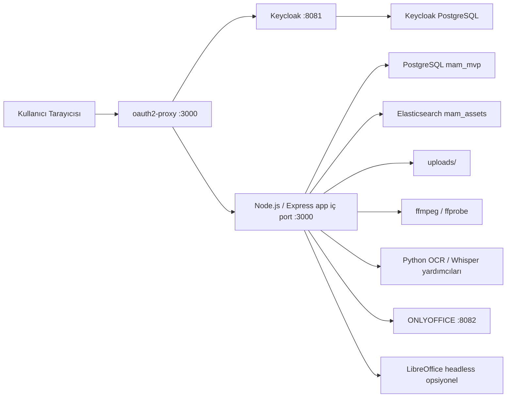

# MAM Deneme Teknik Referans

Tarih: 2026-04-22  
Proje yolu: `/Users/erinc/OyunAlanım/mam_deneme`  
Durum: refaktör sonrası güncel referans

Bu doküman `mam_deneme` uygulamasının güncel teknik yapısını, refaktör sonrası kod ayrımlarını, Docker mimarisini, RPI kurulumunu, Office provider seçeneklerini, performans optimizasyonlarını, diagnostik komutları ve güvenli güncelleme prosedürlerini tek yerde toplar.

Amaç:
- sistemi ilk kez devralan geliştiricinin hızlı onboarding alması
- refaktör sonrası hangi kodun nerede yaşadığını netleştirmek
- arıza anında doğru diagnostik komutları bilmek
- Docker yapısını bozmadan bileşen güncelleyebilmek
- Keycloak, ONLYOFFICE, LibreOffice, Elasticsearch, PostgreSQL ve media pipeline davranışlarını açıklamak
- RPI ve yerel geliştirme kurulumları arasındaki farkları belgelemek

## 1. Sistem Özeti

`mam_deneme`, tek repo içinde çalışan Node.js/Express tabanlı bir MAM prototipidir. Frontend statik dosyaları, backend API, media işleme işleri ve admin araçları aynı `app` container'ında çalışır. Auth, arama, belge görüntüleme ve veritabanı bileşenleri ayrı container'lara ayrılmıştır.

Ana yetenekler:
- medya ingest ve metadata yönetimi
- soft delete, restore ve permanent delete
- disk cleanup ile asset ilişkili dosyaların silinmesi
- video proxy üretimi
- thumbnail üretimi
- subtitle upload/generate/search
- video OCR üretimi/search
- normal asset araması, OCR araması ve altyazı araması
- `+` / `-` operatorleri ve quoted exact phrase araması
- fuzzy / did-you-mean davranışı
- Office belge görüntüleme ve yetkili kullanıcılar için düzenleme
- PDF görüntüleme, OCR/search ve versiyon yönetimi
- Keycloak + oauth2-proxy login zinciri
- admin izin yönetimi
- Elasticsearch index ve reindex
- RPI için opsiyonel LibreOffice headless offline preview

## 2. Refaktör Sonrası Özet

Önceki yapıda iş mantığının büyük bölümü `src/server.js` içinde yaşıyordu. Güncel durumda bazı kritik parçalar ayrıldı:

- `src/routes/office.js`: Office endpoint'leri
- `src/routes/pdf.js`: PDF endpoint'leri
- `src/services/officeService.js`: ONLYOFFICE config, callback ve belge restore iş mantığı
- `src/services/searchService.js`: Elasticsearch index/search/reindex iş mantığı
- `src/services/mediaJobs.js`: process içi job map'leri
- `src/utils/files.js`: dosya adı, extension ve MIME helper'ları
- `src/permissions.js`: permission tanımları ve Keycloak principal çözümleme

`src/server.js` hâlâ ana uygulama dosyasıdır, fakat refaktör sonrası şu role çekilmiştir:
- Express bootstrap
- global config/env çözümleme
- auth/session helper'ları
- asset, OCR, subtitle, admin ve collection route'ları
- media processing orchestration
- route/service bağımlılıklarını enjekte etme
- startup sırasında DB init ve Elasticsearch bootstrap

## 3. Yüksek Seviye Mimari



Kritik port farkı:
- `3000`: kullanıcı girişi için doğru port, oauth2-proxy arkasındadır
- `3001`: yerel compose'da direct app portudur, auth bypass eder, günlük kullanım için doğru değildir
- RPI compose'da direct `3001` dışarı açılmaz

## 4. Çalışma Modları

### 4.1 Normal Docker Compose

Dosya: `docker-compose.yml`

Portlar:
- `3000 -> oauth2-proxy:4180`
- `3001 -> app:3000`
- `8081 -> keycloak:8080`
- `8082 -> onlyoffice:80`
- `9200 -> elasticsearch:9200`
- `5432 -> postgres:5432`

Başlatma:
```bash
docker compose up -d --build
```

Kontrol:
```bash
docker compose ps
curl -I http://127.0.0.1:3000
curl -I http://127.0.0.1:3001
```

Beklenen:
- `3000` genelde `302` ile Keycloak login'e yönlendirir
- `3001` app'i direct açar, auth header yoksa `Unknown user` benzeri davranış görülebilir

### 4.2 Easy Deploy

Dosyalar:
- `docker-compose.easy.yml`
- `deploy/init.sh`
- `deploy/mam.sh`

Amaç:
- host/IP değerini otomatik üretmek
- `.env.easy` üretmek
- Keycloak realm import dosyasını üretmek
- manuel Keycloak ayar ihtiyacını azaltmak

Kullanım:
```bash
./deploy/init.sh
./deploy/mam.sh up
```

Adresler:
```bash
./deploy/mam.sh urls
```

### 4.3 RPI / Ubuntu Server Modu

Dosyalar:
- `docker-compose.rpi.yml`
- `deploy/init-rpi.sh`
- `deploy/mam-rpi.sh`
- `deploy/keycloak/mam-rpi-realm.json`

RPI modunun farkları:
- direct app portu dışarı açılmaz
- kullanıcı sadece `http://<pi-ip>:3000` ile girer
- `PUBLIC_HOST` otomatik algılanır
- Keycloak realm import URL'leri o anki host/IP ile yazılır
- `deploy/.env.rpi` kurulumun ana env dosyasıdır

Temel kurulum:
```bash
sudo apt update
sudo apt install -y git docker.io docker-compose
sudo usermod -aG docker $USER
newgrp docker

cd ~
git clone https://github.com/takmasakal/mam_deneme.git
cd mam_deneme
git checkout main
git pull

./deploy/mam-rpi.sh up
./deploy/mam-rpi.sh urls
```

Adresler:
```text
MAM:      http://<pi-ip>:3000
Keycloak: http://<pi-ip>:8081
```

IP değişirse:
```bash
./deploy/mam-rpi.sh restart
./deploy/mam-rpi.sh urls
```

RPI logları:
```bash
./deploy/mam-rpi.sh logs keycloak
./deploy/mam-rpi.sh logs oauth2-proxy
./deploy/mam-rpi.sh logs app
```

Harici medya diski:
```env
UPLOADS_DIR=/mnt/mamdata/uploads
```

Değişiklikten sonra:
```bash
./deploy/mam-rpi.sh restart
```

## 5. Docker Servisleri

### 5.1 `app`

Görevleri:
- Express API
- static frontend serve
- asset ingest
- proxy/thumbnail üretimi
- OCR/subtitle işleri
- PDF ve Office route delegasyonu
- Elasticsearch index tetikleme

Önemli env:
- `DATABASE_URL`
- `ELASTIC_URL`
- `ELASTIC_INDEX`
- `PORT`
- `KEYCLOAK_INTERNAL_URL`
- `KEYCLOAK_REALM`
- `KEYCLOAK_ADMIN_USERNAME`
- `KEYCLOAK_ADMIN_PASSWORD`
- `USE_OAUTH2_PROXY`
- `OFFICE_EDITOR_PROVIDER`
- `ONLYOFFICE_PUBLIC_URL`
- `ONLYOFFICE_INTERNAL_URL`
- `APP_INTERNAL_URL`
- `INSTALL_LIBREOFFICE` build arg olarak kullanılır

### 5.2 `postgres`

Ana uygulama DB'sidir.

DB adı:
```text
mam_mvp
```

Temel tablolar:
- `assets`
- `asset_versions`
- `asset_cuts`
- `collections`
- `asset_subtitle_cues`
- `asset_ocr_segments`
- `media_processing_jobs`
- `admin_settings`
- `learned_turkish_corrections`

### 5.3 `elasticsearch`

Asset full-text search ve suggestion için kullanılır.

Index:
```text
mam_assets
```

`src/services/searchService.js` tarafından yönetilir.

### 5.4 `keycloak-postgres`

Keycloak'un kendi DB'sidir. Uygulama DB'sinden ayrıdır.

### 5.5 `keycloak`

Auth, realm, client, user ve role yönetimini sağlar.

Yerel port:
```text
http://localhost:8081
```

RPI:
```text
http://<pi-ip>:8081
```

### 5.6 `oauth2-proxy`

Kullanıcı giriş kapısıdır.

Görevleri:
- OIDC login başlatmak
- callback almak
- cookie üretmek
- upstream app'e auth header'ları geçirmek
- logout zincirini yönetmek

Doğru kullanıcı portu:
```text
http://localhost:3000
http://<pi-ip>:3000
```

### 5.7 `onlyoffice`

Office belge görüntüleme/düzenleme container'ıdır.

Notlar:
- `JWT_ENABLED=false`
- private IP isteklerine izin veren config patch uygulanır
- büyük cookie/header durumları için nginx header buffer artırılır
- `8082` dış portundan script ve editor serve eder

### 5.8 LibreOffice Headless

Ayrı container değildir. `INSTALL_LIBREOFFICE=true` ile `app` image içine kurulur.

Kullanım:
```env
OFFICE_EDITOR_PROVIDER=libreoffice
INSTALL_LIBREOFFICE=true
```

Davranış:
- Office dosyasını düzenlemez
- orijinal dosyaya dokunmaz
- PDF preview üretir
- çıktıyı `uploads/previews/libreoffice` altında cache'ler
- RPI için düşük kaynaklı alternatif sağlar

## 6. Kod Haritası

### 6.1 `src/server.js`

Ana bootstrap ve kalan büyük iş mantığı dosyasıdır.

Güncel sorumlulukları:
- Express instance ve static middleware
- env ve path sabitleri
- auth/OIDC helper'ları
- text search parser/helper'ları
- OCR üretim ve arama helper'ları
- subtitle üretim ve arama helper'ları
- media job DB persistence
- asset ingest ve CRUD route'ları
- admin route'ları
- search/office/pdf servislerinin wiring işlemi
- startup sırasında `initDb()`, Türkçe sözlük yükleme ve Elasticsearch backfill tetikleme

Refaktör sonrası `server.js` artık şu işleri doğrudan tutmaz:
- ONLYOFFICE config/callback detayının ana gövdesi: `officeService` ve `routes/office`
- PDF endpoint gövdesi: `routes/pdf`
- Elasticsearch request/index/reindex implementasyonu: `services/searchService`
- job map tanımları: `services/mediaJobs`
- generic file helper'ları: `utils/files`

`server.js` içinde hâlâ bulunan önemli fonksiyon grupları:

Auth/OIDC:
- `buildRealmIssuerUrl`
- `buildRealmJwksUrl`
- `getRequestDerivedOidcSettings`
- `buildLogoutUrl`
- `getBearerFromRequest`
- `hasAuthenticatedUpstreamUser`
- `resolveEffectivePermissions`

Search parser:
- `parseSearchTokens`
- `parseTextSearchQuery`
- `tokenizeSearchTokens`
- `fuzzySearchTextMatch`
- `suggestDidYouMeanFromTexts`
- `exactNormalizedTextRegex`

OCR:
- `searchOcrMatchesForAssetRows`
- `syncOcrSegmentIndexForAsset`
- `saveAssetVideoOcrMetadata`
- `queueVideoOcrJob`
- `extractVideoOcrToText`
- `prepareOcrFrames`
- `extractVideoOcrFrameTextPaddle`

Subtitle:
- `parseSubtitleTextSearchQuery`
- `buildSubtitleCueSearchWhereSql`
- `searchSubtitleMatchesForAssetRows`
- `syncSubtitleCueIndexForAssetRow`
- `queueSubtitleGenerationJob`
- `transcribeMediaToVtt`

Asset/file:
- `getIngestStoragePath`
- `resolveStoredUrl`
- `publicUploadUrlToAbsolutePath`
- `collectAssetCleanupPaths`
- `cleanupAssetFiles`
- `createAssetRecord`
- `mapAssetRow`

Admin/system:
- `getAdminSettings`
- `saveAdminSettings`
- `fetchKeycloakUsers`
- `fetchKeycloakUserPermissionDefaults`
- `/api/admin/system-health`

### 6.2 `src/routes/office.js`

Office route'larını kaydeder. Dışarı `registerOfficeRoutes(app, deps)` verir.

Endpoint'ler:
- `GET /api/assets/:id/office-config`
- `POST /api/assets/:id/office-callback`
- `GET /api/assets/:id/libreoffice-preview.pdf`
- `POST /api/assets/:id/office-restore`
- `POST /api/assets/:id/office-restore-original`
- `GET /api/assets/:id/office-original/download`

Bağımlılıklar dependency injection ile `server.js` tarafından verilir:
- `pool`
- `officeService`
- permission middleware'leri
- file helper'ları
- `indexAssetToElastic`
- `mapAssetRow`
- version/snapshot helper'ları
- LibreOffice için `runCommandCapture`, `uploadsDir`, `sanitizeFileName`

Önemli davranışlar:
- ONLYOFFICE config sadece office candidate dosyalarda döner
- callback save durumunda versiyon oluşturma officeService tarafında yapılır
- LibreOffice preview PDF cache üretir
- office restore işlemleri yetki gerektirir

### 6.3 `src/services/officeService.js`

Office iş mantığını taşır. Dışarı `createOfficeService(deps)` verir.

Sorumlulukları:
- ONLYOFFICE config üretimi
- document key üretimi
- `docUrl` ve `callbackUrl` üretimi
- user id sanitize işlemi
- edit/view mode belirleme
- callback payload işleme
- kaydedilen dosyayı indirme ve asset satırını güncelleme
- asset version snapshot oluşturma
- restore işlemlerinde hash/index güncelleme

Bu servis route bilmez; HTTP response üretmez. Hata durumlarında status taşıyan error fırlatır.

### 6.4 `src/routes/pdf.js`

PDF route'larını kaydeder. Dışarı `registerPdfRoutes(app, deps)` verir.

Endpoint'ler:
- `GET /api/assets/:id/pdf-search`
- `GET /api/assets/:id/pdf-search-ocr`
- `GET /api/assets/:id/pdf-page-text`
- `GET /api/assets/:id/pdf-meta`
- `GET /api/assets/:id/pdf-page-image`
- `POST /api/assets/:id/pdf/save`
- `POST /api/assets/:id/pdf-restore-original`
- `GET /api/assets/:id/pdf-original/download`
- `POST /api/assets/:id/pdf-restore`

Sorumlulukları:
- PDF text extraction sonuçlarını API'ye dökmek
- PDF page image render etmek
- gelişmiş PDF araçlarını yetkiye bağlamak
- save/restore/original download akışlarını yönetmek
- asset index güncellemesini tetiklemek

### 6.5 `src/services/searchService.js`

Elasticsearch iş mantığını taşır. Dışarı `createSearchService(deps)` verir.

Sorumlulukları:
- Elasticsearch HTTP request wrapper
- index varlığını kontrol etmek ve gerekiyorsa oluşturmak
- asset document map etmek
- tek asset indexlemek
- asset'i Elasticsearch'ten silmek
- normal search için ID listesi almak
- suggestion için ID listesi almak
- bulk `_bulk` API ile reindex yapmak

Önemli fonksiyonlar:
- `ensureElasticIndex`
- `indexAssetToElastic`
- `removeAssetFromElastic`
- `searchAssetIdsElastic`
- `suggestAssetIdsElastic`
- `backfillElasticIndex`

Performans notu:
- `backfillElasticIndex` artık asset'leri sayfa sayfa okur
- her sayfayı NDJSON `_bulk` ile gönderir
- bulk başarısız olursa indexed sayısını artırmaz

### 6.6 `src/services/mediaJobs.js`

Process içi job map'lerini tek yerden export eder:
- `proxyJobs`
- `subtitleJobs`
- `videoOcrJobs`

Bu map'ler runtime memory state'tir. Kalıcı job durumu ayrıca `media_processing_jobs` tablosuna yazılır.

### 6.7 `src/utils/files.js`

Genel dosya helper'ları:
- `sanitizeFileName`
- `getFileExtension`
- `inferMimeTypeFromFileName`

Bu dosya browser/route/business logic bilmez. Sadece küçük ve tekrar kullanılabilir dosya yardımcıları içerir.

### 6.8 `src/permissions.js`

Permission modelini merkezi tutar.

Permission key'leri:
- `admin.access`
- `asset.delete`
- `office.edit`
- `metadata.edit`
- `pdf.advanced`

Ana fonksiyonlar:
- `normalizePrincipalNames`
- `getPermissionDefinitionsPayload`
- `resolvePermissionKeysFromPrincipals`
- `permissionKeysToLegacyFlags`
- `normalizePermissionEntry`
- `isAdminName`
- `isAdminByGroupsOrRoles`

Keycloak role/group isimleri normalize edilerek uygulama permission key'lerine çevrilir.

### 6.9 Python yardımcıları

Dosyalar:
- `src/transcribe_whisper.py`
- `src/transcribe_whisperx.py`
- `src/video_ocr_frame_prep.py`
- `src/video_ocr_paddle.py`

Amaç:
- subtitle üretimi
- Whisper/WhisperX entegrasyonu
- OCR frame hazırlığı
- PaddleOCR frame text extraction

Node tarafı bu scriptleri `spawn` / command helper'ları üzerinden çağırır.

## 7. Frontend Haritası

Ana dosyalar:
- `public/index.html`
- `public/main.js`
- `public/admin.html`
- `public/admin.js`
- `public/pdf-viewer.html`
- `public/office-viewer.html`
- `public/i18n.json`

`public/main.js`:
- asset listesi
- üç kolonlu UI
- video player davranışı
- forward/reverse speed selector
- OCR/subtitle highlight
- Office/PDF viewer açma
- delete/restore/version UI

`public/admin.js`:
- sistem ayarları
- permission yönetimi
- OCR/subtitle kayıt admin ekranları
- proxy tools
- system health ekranı

Office viewer davranışı:
- `OFFICE_EDITOR_PROVIDER=onlyoffice` ise ONLYOFFICE script/config kullanılır
- `OFFICE_EDITOR_PROVIDER=libreoffice` ise PDF viewer üzerinden generated PDF preview açılır
- fallback preview istenmez; Office viewer başarısızsa açık hata gösterilmelidir

## 8. Veritabanı Şeması

### 8.1 `assets`

Ana asset tablosudur.

Önemli kolonlar:
- `id`
- `title`
- `description`
- `type`
- `tags`
- `owner`
- `duration_seconds`
- `source_path`
- `media_url`
- `proxy_url`
- `proxy_status`
- `thumbnail_url`
- `file_name`
- `mime_type`
- `dc_metadata`
- `file_hash`
- `status`
- `deleted_at`
- `created_at`
- `updated_at`

### 8.2 `asset_versions`

Asset version snapshot'larını tutar.

Önemli kolonlar:
- `version_id`
- `asset_id`
- `label`
- `note`
- `snapshot_media_url`
- `snapshot_source_path`
- `snapshot_file_name`
- `snapshot_mime_type`
- `snapshot_thumbnail_url`
- `actor_username`
- `action_type`
- `restored_from_version_id`
- `created_at`

Office/PDF save ve restore işlemleri bu tabloyla ilişkilidir.

### 8.3 `asset_cuts`

Asset cut/clip bilgisini tutar.

Kolonlar:
- `cut_id`
- `asset_id`
- `label`
- `in_point_seconds`
- `out_point_seconds`
- `created_at`

### 8.4 `asset_subtitle_cues`

Aranabilir altyazı index tablosudur.

Kolonlar:
- `asset_id`
- `subtitle_url`
- `seq`
- `start_sec`
- `end_sec`
- `cue_text`
- `norm_text`
- `confidence`
- `source_engine`
- `lang`
- `created_at`

Arama `norm_text` üzerinden çalışır. Aktif altyazı URL'si `assets.dc_metadata.subtitleUrl` ile eşleştirilir.

### 8.5 `asset_ocr_segments`

Aranabilir OCR segment index tablosudur.

Kolonlar:
- `asset_id`
- `ocr_url`
- `seq`
- `start_sec`
- `end_sec`
- `segment_text`
- `norm_text`
- `confidence`
- `source_engine`
- `lang`
- `created_at`

Arama `norm_text` üzerinden çalışır. Aktif OCR URL'si `dc_metadata` içinden seçilir.

### 8.6 `media_processing_jobs`

Subtitle ve video OCR job kalıcı durum tablosudur.

Kolonlar:
- `job_id`
- `asset_id`
- `job_type`
- `status`
- `request_payload`
- `result_payload`
- `error_text`
- `progress`
- `created_at`
- `updated_at`
- `started_at`
- `finished_at`

### 8.7 `admin_settings`

Admin UI ayarlarını JSONB olarak tutar.

### 8.8 `learned_turkish_corrections`

OCR/Türkçe düzeltme öğrenilmiş kelime çiftlerini tutar.

## 9. İndeks ve Performans Tasarımı

PostgreSQL tarafında `pg_trgm` extension açılır.

Önemli indeksler:
- `idx_assets_deleted_updated`
- `idx_assets_title_trgm`
- `idx_assets_file_name_trgm`
- `idx_assets_owner_trgm`
- `idx_assets_title_fold_trgm`
- `idx_assets_file_name_fold_trgm`
- `idx_assets_owner_fold_trgm`
- `idx_assets_description_fold_trgm`
- `idx_asset_cuts_label_fold_trgm`
- `idx_subtitle_cues_asset_url_start`
- `idx_subtitle_cues_norm_trgm`
- `idx_ocr_segments_asset_url_start`
- `idx_ocr_segments_norm_trgm`
- `idx_media_jobs_asset_type_updated`

Neden iki tip trigram indeks var:
- `LOWER(title)` gibi basit expression bazı eski/farklı sorgulara yarar
- Türkçe fold expression indeksleri gerçek arama sorgularıyla eşleşsin diye eklidir

`/api/assets` performans davranışı:
- arama yoksa pagination SQL tarafında `LIMIT/OFFSET` ile yapılır
- `q`, `ocrQ` veya `subtitleQ` varsa önce ilgili search/filter uygulanır, sonra response pagination yapılır
- liste endpoint'i default olarak lazy thumbnail üretmez
- thumbnail/PDF preview üretimi sadece `ensurePreview=1` ile istenir

OCR/subtitle performans davranışı:
- eski per-asset loop yerine toplu DB sorgusu kullanılır
- aktif URL eşleşmesi korunur
- her asset için window function ile sınırlı sayıda hit alınır
- fuzzy/did-you-mean sadece exact sonuç yoksa ve operator yoksa devreye girer

Elasticsearch performans davranışı:
- reindex `_bulk` API kullanır
- asset + cut labels tek sorguyla sayfa sayfa okunur
- her bulk chunk 250 asset civarında gönderilir

Cache davranışı:
- Keycloak user listesi kısa süreli cache'lenir
- Keycloak permission defaults cache'lenir
- `/api/admin/system-health` cache'lenir
- system health force refresh: `?refresh=1`

## 10. Arama Davranışı

### 10.1 Operatorler

Desteklenen davranış:
- `+kelime`: kelime zorunlu
- `-kelime`: kelime geçenleri hariç tut
- `"kelime"`: kelime bazlı exact eşleşme
- `+"kelime"`: exact kelime zorunlu
- `-"kelime"`: exact kelime geçenleri hariç tut

Örnekler:
```text
+omuz -sıkışma
+"omuz" -sıkışma
+"omuz" -"eklem"
omuzz
```

Operator yoksa mevcut düz metin / contains davranışı korunur.

### 10.2 Normal asset araması

Kaynaklar:
- Elasticsearch varsa öncelikli
- Elasticsearch yoksa PostgreSQL fallback
- fuzzy fallback sadece operator yoksa devreye girer

Aranan alanlar:
- title
- description
- owner
- tags
- dc metadata
- cut labels

### 10.3 OCR araması

Kaynak:
- `asset_ocr_segments.norm_text`

Aktif OCR seçimi:
- asset `dc_metadata` içindeki son/aktif OCR URL'si üzerinden filtrelenir

Hit payload:
- line text
- start/end seconds
- timecode
- highlight query
- fuzzy/did-you-mean meta

### 10.4 Altyazı araması

Kaynak:
- `asset_subtitle_cues.norm_text`

Aktif altyazı seçimi:
- `dc_metadata.subtitleUrl`

Hit payload:
- cue text
- start/end seconds
- timecode
- highlight query
- fuzzy/did-you-mean meta

## 11. API Haritası

### 11.1 Genel

- `GET /api/workflow`
- `GET /api/me`
- `GET /api/logout-url`
- `GET /api/ui-settings`

### 11.2 Assets

- `GET /api/assets`
- `GET /api/assets/suggest`
- `GET /api/assets/ocr-suggest`
- `GET /api/assets/subtitle-suggest`
- `POST /api/assets`
- `POST /api/assets/upload`
- `GET /api/assets/:id`
- `GET /api/assets/:id/technical`
- `PATCH /api/assets/:id`
- `DELETE /api/assets/:id`
- `POST /api/assets/:id/trash`
- `POST /api/assets/:id/restore`
- `POST /api/assets/:id/transition`

### 11.3 Cuts

- `POST /api/assets/:id/cuts`
- `PATCH /api/assets/:id/cuts/:cutId`
- `DELETE /api/assets/:id/cuts/:cutId`

### 11.4 Versions

- `POST /api/assets/:id/versions`
- `PATCH /api/assets/:id/versions/:versionId`
- `DELETE /api/assets/:id/versions/:versionId`

### 11.5 Subtitle

- `POST /api/assets/:id/subtitles`
- `POST /api/assets/:id/subtitles/generate`
- `GET /api/subtitle-jobs/:jobId`
- `PATCH /api/assets/:id/subtitles`
- `DELETE /api/assets/:id/subtitles`
- `GET /api/assets/:id/subtitles/search`
- `GET /api/assets/:id/subtitles/suggest`

### 11.6 Video OCR

- `POST /api/assets/:id/video-ocr/extract`
- `GET /api/video-ocr-jobs/:jobId`
- `GET /api/assets/:id/video-ocr/latest`
- `POST /api/assets/:id/video-ocr/save`
- `GET /api/video-ocr-jobs/:jobId/download`

### 11.7 Office

Route dosyası: `src/routes/office.js`

- `GET /api/assets/:id/office-config`
- `POST /api/assets/:id/office-callback`
- `GET /api/assets/:id/libreoffice-preview.pdf`
- `POST /api/assets/:id/office-restore`
- `POST /api/assets/:id/office-restore-original`
- `GET /api/assets/:id/office-original/download`

### 11.8 PDF

Route dosyası: `src/routes/pdf.js`

- `GET /api/assets/:id/pdf-search`
- `GET /api/assets/:id/pdf-search-ocr`
- `GET /api/assets/:id/pdf-page-text`
- `GET /api/assets/:id/pdf-meta`
- `GET /api/assets/:id/pdf-page-image`
- `POST /api/assets/:id/pdf/save`
- `POST /api/assets/:id/pdf-restore-original`
- `GET /api/assets/:id/pdf-original/download`
- `POST /api/assets/:id/pdf-restore`

### 11.9 Admin

- `GET /api/admin/turkish-corrections`
- `POST /api/admin/turkish-corrections`
- `PUT /api/admin/turkish-corrections`
- `DELETE /api/admin/turkish-corrections`
- `GET /api/admin/ocr-records`
- `PATCH /api/admin/ocr-records`
- `DELETE /api/admin/ocr-records`
- `GET /api/admin/ocr-records/content`
- `PATCH /api/admin/ocr-records/content`
- `GET /api/admin/subtitle-records`
- `PATCH /api/admin/subtitle-records`
- `DELETE /api/admin/subtitle-records`
- `GET /api/admin/subtitle-records/content`
- `PATCH /api/admin/subtitle-records/content`
- `GET /api/admin/text-search`
- `GET /api/admin/workflow-tracking`
- `GET /api/admin/settings`
- `PATCH /api/admin/settings`
- `GET /api/admin/user-permissions`
- `PATCH /api/admin/user-permissions/:username`
- `POST /api/admin/api-token/rotate`
- `GET /api/admin/system-health`
- `GET /api/admin/ffmpeg-health`
- `POST /api/admin/search/reindex`
- `POST /api/admin/proxy-jobs`
- `GET /api/admin/proxy-jobs`
- `GET /api/admin/proxy-jobs/:id`
- `GET /api/admin/assets/suggest`
- `POST /api/admin/proxy-tools/run`

### 11.10 Collections

- `GET /api/collections`
- `POST /api/collections`

## 12. Veri Akışları

### 12.1 Login

1. Kullanıcı `http://localhost:3000` veya `http://<pi-ip>:3000` açar.
2. İstek `oauth2-proxy`ye gelir.
3. Cookie yoksa Keycloak auth URL'sine yönlenir.
4. Keycloak login sonrası `/oauth2/callback` çağrılır.
5. `oauth2-proxy` token alır ve session cookie yazar.
6. Upstream istek `app:3000` servisine header'larla geçer.
7. Backend kullanıcıyı `x-forwarded-user`, `x-auth-request-user`, token claims, groups/roles üzerinden çözer.

### 12.2 Upload

1. Frontend upload payload gönderir.
2. Backend dosyayı `uploads/YYYY-MM-DD/<type>/...` altına yazar.
3. SHA-256 hash hesaplanır.
4. Duplicate varsa `409 duplicate_asset_content` döner.
5. Asset DB kaydı oluşturulur.
6. Video ise proxy/thumbnail job tetiklenebilir.
7. Elasticsearch index güncellenir.
8. UI asset listesini yeniler.

### 12.3 Permanent Delete

1. `DELETE /api/assets/:id` çağrılır.
2. Yetki kontrolü yapılır.
3. Asset, versiyonlar ve ilişkili path'ler toplanır.
4. DB kaydı silinir.
5. Elasticsearch kaydı silinir.
6. `uploads/originals`, `uploads/proxies`, `uploads/thumbnails`, subtitle/OCR artifacts ve version snapshot dosyaları temizlenir.

### 12.4 Office Save

1. Kullanıcı Office viewer açar.
2. Frontend `/office-config` alır.
3. ONLYOFFICE belgeyi açar.
4. Save durumunda `/office-callback` çağrılır.
5. `officeService` callback URL'den yeni dosyayı indirir.
6. Eski asset state version snapshot olarak kaydedilir.
7. Asset path/hash güncellenir.
8. Elasticsearch yeniden indexlenir.

### 12.5 LibreOffice Preview

1. Frontend office provider'ın `libreoffice` olduğunu görür.
2. `/api/assets/:id/libreoffice-preview.pdf` URL'si PDF viewer'a verilir.
3. Route cache PDF var mı kontrol eder.
4. Yoksa `libreoffice` veya `soffice` headless convert çalışır.
5. PDF `uploads/previews/libreoffice` altına yazılır.
6. Orijinal Office dosyası değişmez.

### 12.6 PDF Save/Restore

1. PDF viewer edit/save endpoint'ini çağırır.
2. Gelişmiş PDF yetkisi kontrol edilir.
3. Yeni PDF dosyası yazılır.
4. Version snapshot oluşturulur.
5. Asset hash/path/thumbnail bilgisi güncellenir.
6. Elasticsearch indexlenir.

### 12.7 OCR Job

1. Kullanıcı video OCR extraction başlatır.
2. `media_processing_jobs` kaydı oluşturulur.
3. Frame prep yapılır.
4. OCR engine frame'leri işler.
5. Segmentler normalize edilir.
6. OCR text artifact yazılır.
7. `asset_ocr_segments` doldurulur.
8. Asset metadata güncellenir.

### 12.8 Subtitle Job

1. Kullanıcı subtitle generate başlatır.
2. Whisper/WhisperX backend seçilir.
3. Audio gerekirse hazırlanır.
4. VTT/SRT üretilir.
5. `asset_subtitle_cues` doldurulur.
6. Asset `dc_metadata.subtitleUrl` güncellenir.

## 13. Office Provider Detayı

### 13.1 ONLYOFFICE

Açmak için:
```env
OFFICE_EDITOR_PROVIDER=onlyoffice
INSTALL_LIBREOFFICE=false
```

Gerekli servis:
```bash
docker compose up -d onlyoffice app
```

Kontrol:
```bash
curl -I http://127.0.0.1:8082
curl -I http://127.0.0.1:8082/web-apps/apps/api/documents/api.js
```

Tarayıcı aynı origin/cookie nedeniyle header büyütürse compose içindeki nginx buffer patch devreye girer.

### 13.2 LibreOffice

Açmak için:
```env
OFFICE_EDITOR_PROVIDER=libreoffice
INSTALL_LIBREOFFICE=true
```

Build/start:
```bash
docker compose up -d --build app
```

RPI:
```bash
nano deploy/.env.rpi
./deploy/mam-rpi.sh restart
```

Opsiyonel olarak ONLYOFFICE durdurma:
```bash
docker compose --env-file deploy/.env.rpi -f docker-compose.rpi.yml stop onlyoffice
```

Kontrol:
```bash
docker compose exec app which libreoffice || docker compose exec app which soffice
docker compose logs --tail=100 app
```

Sınırlama:
- düzenleme yoktur
- save/version callback yoktur
- sadece offline read-only PDF preview sağlar

### 13.3 Provider `none`

Açmak için:
```env
OFFICE_EDITOR_PROVIDER=none
```

Bu modda Office preview/edit kapalıdır. Fallback preview istenmez.

## 14. Keycloak ve Auth Yönetimi

### 14.1 Admin Hesabı

Geliştirme default'u:
```text
admin / admin
```

Bu değer production veya kalıcı RPI kullanımında değiştirilmelidir.

Yerel `.env`:
```env
KEYCLOAK_ADMIN=admin
KEYCLOAK_ADMIN_PASSWORD=YeniGucluSifre
KEYCLOAK_DB_USER=keycloak
KEYCLOAK_DB_PASSWORD=keycloak
KEYCLOAK_DB_NAME=keycloak
```

RPI `deploy/.env.rpi`:
```env
KEYCLOAK_ADMIN=admin
KEYCLOAK_ADMIN_PASSWORD=YeniGucluSifre
```

Önemli:
- Bu env değerleri ilk bootstrap sırasında admin hesabını yaratır.
- Keycloak DB volume'u zaten varsa env değiştirmek mevcut şifreyi otomatik değiştirmeyebilir.
- Mevcut şifre biliniyorsa panelden değiştirmek en temiz yöntemdir.

Panel:
```text
master realm -> Users -> admin -> Credentials -> Set password -> Temporary OFF
```

CLI:
```bash
docker compose exec keycloak /opt/keycloak/bin/kcadm.sh config credentials \
  --server http://localhost:8080 \
  --realm master \
  --user admin \
  --password EskiSifre

docker compose exec keycloak /opt/keycloak/bin/kcadm.sh set-password \
  --realm master \
  --username admin \
  --new-password YeniGucluSifre
```

Eski şifre bilinmiyorsa:
- veri korunacaksa önce Keycloak DB backup alınır
- geliştirme ortamında volume silinerek sıfır bootstrap yapılabilir
- volume silmek realm, client, user ve role bilgilerini de siler

### 14.2 Client Ayarları

Client ID:
```text
mam-web
```

Standart flow açık olmalıdır.

Client authentication açık olmalıdır.

Redirect URL örnekleri:
```text
http://localhost:3000/oauth2/callback
http://<host>:3000/oauth2/callback
```

Post logout redirect örnekleri:
```text
http://localhost:3000/*
http://<host>:3000/*
```

Web origins:
```text
http://localhost:3000
http://<host>:3000
```

RPI'da bunlar `deploy/init-rpi.sh` tarafından realm import içine yazılır.

### 14.3 oauth2-proxy Kritik Env

- `OAUTH2_PROXY_OIDC_ISSUER_URL`
- `OAUTH2_PROXY_LOGIN_URL`
- `OAUTH2_PROXY_REDEEM_URL`
- `OAUTH2_PROXY_OIDC_JWKS_URL`
- `OAUTH2_PROXY_CLIENT_ID`
- `OAUTH2_PROXY_CLIENT_SECRET`
- `OAUTH2_PROXY_REDIRECT_URL`
- `OAUTH2_PROXY_BACKEND_LOGOUT_URL`
- `OAUTH2_PROXY_COOKIE_SECRET`

Yerel normal compose'da browser-facing URL genelde `localhost` olur. RPI'da `PUBLIC_HOST` ile IP/hostname yazılır.

## 15. Diagnostik Komutları

### 15.1 Genel Durum

```bash
docker compose ps
docker compose logs --tail=120 app
docker compose logs --tail=120 oauth2-proxy
docker compose logs --tail=120 keycloak
```

RPI:
```bash
./deploy/mam-rpi.sh ps
./deploy/mam-rpi.sh logs app
./deploy/mam-rpi.sh logs oauth2-proxy
./deploy/mam-rpi.sh logs keycloak
```

### 15.2 Compose Render

```bash
docker compose config > /tmp/mam-compose.yml
PUBLIC_HOST=127.0.0.1 docker compose -f docker-compose.rpi.yml config > /tmp/mam-rpi-compose.yml
```

Ne işe yarar:
- env interpolation doğru mu
- `${PUBLIC_HOST}` boş mu
- build args doğru mu
- portlar çakışıyor mu

### 15.3 Auth Zinciri

```bash
curl -I http://127.0.0.1:3000
```

Beklenen:
- `302 Found`
- `Location:` içinde Keycloak auth URL
- `redirect_uri` doğru host ve portu göstermeli

OAuth2-proxy env:
```bash
docker inspect mam-oauth2-proxy --format '{{range .Config.Env}}{{println .}}{{end}}' | rg '^OAUTH2_PROXY_'
```

### 15.4 Keycloak

```bash
curl -I http://127.0.0.1:8081
curl -s http://127.0.0.1:8081/realms/mam/.well-known/openid-configuration | jq '.issuer'
docker compose logs --tail=200 keycloak
```

RPI browser-facing:
```bash
curl -I http://<pi-ip>:8081
curl -s http://<pi-ip>:8081/realms/mam/.well-known/openid-configuration | jq '.issuer'
```

Sık hata:
- Keycloak geç açılır, RPI'da birkaç dakika `Updating the configuration...` görülebilir
- `invalid_client_credentials`: client secret uyuşmuyor
- boş host URL: `PUBLIC_HOST` boş üretilmiş

### 15.5 PostgreSQL

```bash
docker compose exec postgres psql -U postgres -d mam_mvp -c '\dt'
docker compose exec postgres psql -U postgres -d mam_mvp -c 'select count(*) from assets;'
docker compose exec postgres psql -U postgres -d mam_mvp -c 'select id,title,type,updated_at from assets order by updated_at desc limit 20;'
```

Index kontrolü:
```bash
docker compose exec postgres psql -U postgres -d mam_mvp -c "select indexname from pg_indexes where schemaname='public' order by indexname;"
```

Trigram extension:
```bash
docker compose exec postgres psql -U postgres -d mam_mvp -c "select * from pg_extension where extname='pg_trgm';"
```

### 15.6 Elasticsearch

```bash
curl -s http://127.0.0.1:9200
curl -s http://127.0.0.1:9200/_cat/indices?v
curl -s http://127.0.0.1:9200/mam_assets/_search?pretty
```

Reindex:
```bash
curl -X POST http://127.0.0.1:3001/api/admin/search/reindex
```

Not:
- `3001` direct app portu olduğundan API token/auth ayarına göre farklı cevap verebilir
- normal UI üzerinden admin panelden reindex çalıştırmak daha güvenlidir

### 15.7 ffmpeg / ffprobe

```bash
docker compose exec app ffmpeg -version
docker compose exec app ffprobe -version
```

### 15.8 Python / OCR / Whisper

```bash
docker compose exec app python3 -c "import faster_whisper, cv2, numpy; print('ok')"
docker compose exec app python3 -c "import torch, torchaudio; print('ok')"
docker compose exec app python3 -c "import paddleocr; print('ok')"
```

Not:
- `paddleocr` bazı mimarilerde intentionally skip edilebilir
- RPI'da ağır OCR modelleri pratik olmayabilir

### 15.9 LibreOffice

```bash
docker compose exec app which libreoffice || docker compose exec app which soffice
docker compose exec app libreoffice --version || docker compose exec app soffice --version
```

Preview cache:
```bash
find uploads/previews/libreoffice -type f | head
```

### 15.10 ONLYOFFICE

```bash
curl -I http://127.0.0.1:8082
curl -I http://127.0.0.1:8082/web-apps/apps/api/documents/api.js
docker compose logs --tail=150 onlyoffice
```

Eğer browser `http://localhost:3000/onlyoffice/...` üzerinden proxylenmiş script kullanıyorsa:
```bash
curl -I http://127.0.0.1:3000/onlyoffice/web-apps/apps/api/documents/api.js
```

### 15.11 Upload / Orphan Dosyalar

```bash
find uploads -type f | wc -l
node scripts/report_orphan_uploads.js
```

Amaç:
- DB referansı olmayan dosyaları raporlamak
- cleanup öncesi güvenli analiz yapmak

### 15.12 System Health

```bash
curl -s http://127.0.0.1:3001/api/admin/system-health | jq
curl -s 'http://127.0.0.1:3001/api/admin/system-health?refresh=1' | jq
```

Not:
- cache nedeniyle kısa süre içinde aynı değer dönebilir
- `refresh=1` force refresh yapar

### 15.13 Kod Sağlık Kontrolü

```bash
npm run check
```

Bu script şunları kontrol eder:
- `node --check src/server.js`
- route/service/helper dosyaları
- frontend JS dosyaları
- normal compose config
- RPI compose config

## 16. Sık Arıza Senaryoları

### 16.1 `Unknown user`

Olası neden:
- kullanıcı `3001` direct app portuna girmiştir

Çözüm:
- `3000` portunu kullan

### 16.2 `Cannot GET /oauth2/sign_out`

Olası neden:
- logout direct app portunda denenmiştir

Çözüm:
- `3000` portundan kullan
- logout endpoint oauth2-proxy tarafındadır

### 16.3 `invalid_client_credentials`

Olası neden:
- Keycloak `mam-web` client secret ile `OAUTH2_PROXY_CLIENT_SECRET` farklıdır

Kontrol:
```bash
docker compose logs --tail=120 keycloak
docker inspect mam-oauth2-proxy --format '{{range .Config.Env}}{{println .}}{{end}}' | grep OAUTH2_PROXY_CLIENT_SECRET
```

Çözüm:
- Keycloak client secret ile env'i eşitle
- RPI'da `./deploy/mam-rpi.sh restart` realm/env dosyalarını yeniden üretir

### 16.4 `missing code` callback hatası

Olası neden:
- callback URL manuel açılmıştır
- browser eski yarım kalmış callback state kullanıyordur
- redirect URI / cookie state uyuşmuyor

Çözüm:
- cookie temizle
- doğru giriş portu `3000` üzerinden baştan login ol
- redirect URL'lerini kontrol et

### 16.5 Keycloak çok geç açılıyor

RPI'da normal olabilir.

Kontrol:
```bash
./deploy/mam-rpi.sh logs keycloak
```

Beklenen geçici log:
```text
Updating the configuration and installing your custom providers, if any. Please wait.
Quarkus augmentation completed ...
```

### 16.6 ONLYOFFICE `-4 Yükleme başarısız oldu`

Kontrol:
- doc URL app container'dan erişilebilir mi
- callback URL onlyoffice container'dan erişilebilir mi
- `ONLYOFFICE_PUBLIC_URL` browser'dan açılıyor mu
- private IP policy patch uygulanmış mı
- document key değişiyor mu

Komutlar:
```bash
docker compose logs --tail=150 onlyoffice
docker compose logs --tail=150 app
curl -I http://127.0.0.1:8082/web-apps/apps/api/documents/api.js
```

### 16.7 LibreOffice preview yok

Kontrol:
```bash
docker compose exec app which libreoffice || docker compose exec app which soffice
docker compose logs --tail=100 app
```

Olası neden:
- `INSTALL_LIBREOFFICE=true` ile rebuild yapılmamıştır
- `OFFICE_EDITOR_PROVIDER=libreoffice` set edilmemiştir
- kaynak dosya path'i diskte yoktur

### 16.8 Arama beklenen sonucu vermiyor

Kontrol:
```bash
docker compose exec postgres psql -U postgres -d mam_mvp -c 'select count(*) from asset_subtitle_cues;'
docker compose exec postgres psql -U postgres -d mam_mvp -c 'select count(*) from asset_ocr_segments;'
curl -s http://127.0.0.1:9200/_cat/indices?v
```

Notlar:
- OCR/subtitle arama aktif URL'ye göre filtreler
- eski OCR/subtitle artifact'i diskte dursa bile aktif metadata değilse sonuç üretmez
- operator kullanılan sorgularda fuzzy fallback kapalıdır

### 16.9 Safari playback sesi bozuk

Mevcut çözüm:
- Safari'de Web Audio graph bypass edilir
- Chrome davranışıyla Safari davranışı farklı olabilir

## 17. Güvenli Güncelleme Rehberi

### 17.1 Genel Hazırlık

```bash
cd /Users/erinc/OyunAlanım/mam_deneme
git status --short
git pull
docker compose ps
docker compose config > /tmp/mam-compose.rendered.yml
```

Backup:
```bash
docker compose exec postgres pg_dump -U postgres mam_mvp > /tmp/mam_mvp_backup.sql
docker compose exec keycloak-postgres pg_dump -U keycloak keycloak > /tmp/keycloak_backup.sql
```

### 17.2 App Güncelleme

```bash
docker compose build app
docker compose up -d app oauth2-proxy
npm run check
```

Smoke test:
```bash
curl -I http://127.0.0.1:3000
docker compose logs --tail=150 app
```

### 17.3 Keycloak Güncelleme

Image:
```text
quay.io/keycloak/keycloak:25.0
```

Adımlar:
```bash
docker compose config
docker compose up -d keycloak-postgres keycloak
docker compose logs --tail=200 keycloak
curl -I http://127.0.0.1:8081
```

Dikkat:
- major upgrade öncesi Keycloak release notes okunmalı
- DB backup alınmadan volume silinmemeli

### 17.4 oauth2-proxy Güncelleme

Image:
```text
quay.io/oauth2-proxy/oauth2-proxy:v7.6.0
```

Adımlar:
```bash
docker compose up -d oauth2-proxy
docker compose logs --tail=200 oauth2-proxy
curl -I http://127.0.0.1:3000
```

Risk alanları:
- cookie davranışı
- redirect URL encoding
- issuer strictness
- logout parametreleri

### 17.5 Elasticsearch Güncelleme

Image:
```text
docker.elastic.co/elasticsearch/elasticsearch:8.13.4
```

Hazırlık:
```bash
curl -s http://127.0.0.1:9200/_cat/indices?v
curl -s http://127.0.0.1:9200/mam_assets/_mapping?pretty > /tmp/mam_assets_mapping.json
```

Güncelleme:
```bash
docker compose up -d elasticsearch
curl -s http://127.0.0.1:9200/_cat/indices?v
```

Major version sıçramalarında index compatibility ayrıca değerlendirilmelidir.

### 17.6 PostgreSQL Güncelleme

Image:
```text
postgres:16
```

Adımlar:
```bash
docker compose exec postgres pg_dump -U postgres mam_mvp > /tmp/mam_mvp_backup.sql
docker compose up -d postgres
docker compose exec postgres psql -U postgres -d mam_mvp -c 'select version();'
```

### 17.7 ONLYOFFICE Güncelleme

Image:
```text
onlyoffice/documentserver:8.3
```

Adımlar:
```bash
docker compose up -d onlyoffice
curl -I http://127.0.0.1:8082
curl -I http://127.0.0.1:8082/web-apps/apps/api/documents/api.js
```

Kontrol:
- private IP config patch korunuyor mu
- nginx header buffer patch korunuyor mu
- Office save callback hâlâ version oluşturuyor mu

### 17.8 LibreOffice Güncelleme

LibreOffice app image içinde apt paketleriyle gelir.

Adımlar:
```bash
INSTALL_LIBREOFFICE=true docker compose build app
docker compose up -d app
docker compose exec app libreoffice --version || docker compose exec app soffice --version
```

RPI:
```bash
./deploy/mam-rpi.sh restart
```

### 17.9 Python / OCR Bağımlılıkları

Dockerfile içindeki apt/pip dependency seti değiştirildikten sonra:
```bash
docker compose build app
docker compose up -d app
docker compose exec app python3 -c "import faster_whisper, cv2, numpy; print('ok')"
```

## 18. Refaktör Sonrası Geliştirme Kuralları

Yeni endpoint eklerken:
- Office ise `src/routes/office.js` veya `src/services/officeService.js`
- PDF ise `src/routes/pdf.js`
- Elasticsearch ise `src/services/searchService.js`
- permission modeli ise `src/permissions.js`
- dosya helper'ı ise `src/utils/files.js`
- generic asset/OCR/subtitle endpoint ise şimdilik `src/server.js`

`server.js` daha fazla büyütülmemeli. Yeni büyük feature için route/service ayrımı tercih edilmeli.

Dependency injection prensibi:
- route dosyası global import ile server internallerine erişmemeli
- gerekli fonksiyonlar `registerXRoutes(app, deps)` üzerinden verilmeli
- servisler HTTP response üretmemeli, iş mantığı ve hata fırlatma yapmalı

Test/check kuralı:
```bash
npm run check
```

Yeni JS dosyası eklendiğinde `scripts/check.sh` içine `node --check` satırı eklenmeli.

## 19. Git / Deployment Notları

Pull sonrası başlatma:
```bash
git pull
docker compose up -d --build
```

RPI pull sonrası:
```bash
git pull
./deploy/mam-rpi.sh restart
```

Eğer `INSTALL_LIBREOFFICE` değiştiyse rebuild gerekir.

Eski image/katman karışıklığından şüphelenilirse:
```bash
docker compose build --no-cache app
docker compose up -d app
```

Container logları her zaman ilk kontrol noktasıdır:
```bash
docker compose logs --tail=200 app
docker compose logs --tail=200 oauth2-proxy
docker compose logs --tail=200 keycloak
```

## 20. Dosya ve Dizin Sözlüğü

- `uploads/originals`: orijinal veya ingest edilmiş ana dosyalar
- `uploads/proxies`: video proxy dosyaları
- `uploads/thumbnails`: thumbnail çıktıları
- `uploads/subtitles`: subtitle artifact'leri
- `uploads/ocr`: OCR text ve frame çalışma alanları
- `uploads/previews/libreoffice`: LibreOffice PDF preview cache
- `uploads/_config`: runtime config ve correction dosyaları
- `data/`: app runtime data alanı
- `deploy/`: deployment wrapper ve generated env/realm dosyaları
- `docs/`: teknik dokümanlar
- `public/`: frontend statik dosyaları
- `src/`: backend ve helper kodları

## 21. Minimum Smoke Test Listesi

Kurulum veya güncelleme sonrası:

```bash
npm run check
docker compose ps
curl -I http://127.0.0.1:3000
curl -I http://127.0.0.1:8081
curl -s http://127.0.0.1:9200/_cat/indices?v
docker compose logs --tail=100 app
```

UI üzerinden:
- `http://localhost:3000` login açılıyor mu
- asset listesi geliyor mu
- upload çalışıyor mu
- video proxy/thumbnail oluşuyor mu
- OCR/subtitle araması çalışıyor mu
- `+"omuz" -sıkışma` gibi operator sorguları beklenen davranışı veriyor mu
- Office provider moduna göre ONLYOFFICE veya LibreOffice preview çalışıyor mu
- PDF original download / restore butonları çalışıyor mu
- admin system health ekranı açılıyor mu

## 22. Güncel Teknik Borç / Sonraki Refaktör Adayları

Adaylar:
- asset route'larını `src/routes/assets.js` içine almak
- subtitle route'larını `src/routes/subtitles.js` içine almak
- OCR route'larını `src/routes/ocr.js` içine almak
- admin route'larını `src/routes/admin.js` içine almak
- media orchestration kodunu `src/services/mediaProcessingService.js` içine almak
- file cleanup/versioning helper'larını ayrı servis yapmak
- integration test veya API smoke test eklemek
- PostgreSQL migration sistemini `CREATE TABLE IF NOT EXISTS` bootstrap'ten ayrı versiyonlu migration yapısına taşımak

Öncelik sırası:
1. Asset CRUD ve list endpoint'ini route/service ayrımına taşımak
2. Admin route'larını bölmek
3. OCR/subtitle orchestration servislerini ayırmak
4. DB migration mekanizmasını versiyonlamak
5. API smoke test seti eklemek

## 23. Son Not

Bu doküman 2026-04-22 refaktör sonrası kod yapısını referans alır. `src/server.js` hâlâ büyük ve merkezi bir dosyadır, ancak Office, PDF, Elasticsearch, media job map'leri, permission ve dosya helper'ları ayrılmıştır. Bundan sonraki geliştirmelerde yeni büyük parçaların `routes/` ve `services/` altında konumlandırılması mimari borcu azaltacaktır.
